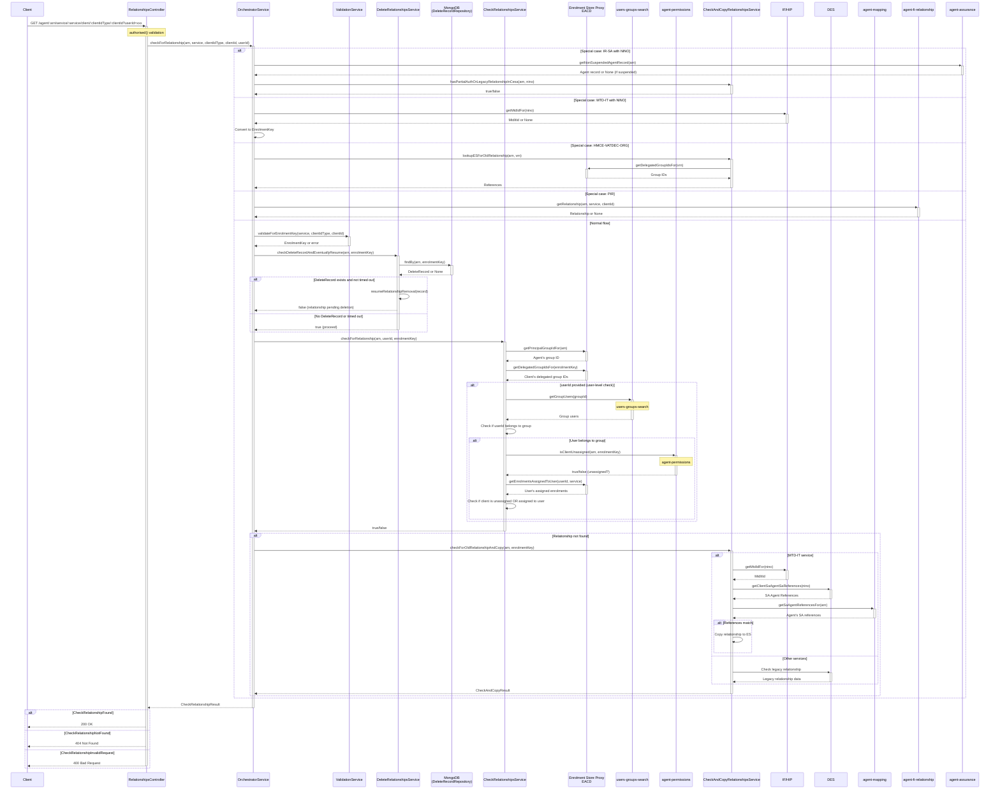

# ACR01: Check Agent-Client Relationship

## Overview

Checks if a relationship exists between an agent and a client for a specific service. This endpoint orchestrates a complex multi-layered validation flow that includes:

1. **Pending Deletion Check**: Verifies if the relationship is pending deletion in MongoDB
2. **Active Relationship Check**: Queries EACD (enrolment-store-proxy) for active delegated relationships
3. **Granular Permissions Check**: Optionally validates user-level access when userId is provided
4. **Legacy Relationship Fallback**: If not found in EACD, checks legacy CESA relationships in DES/IF
5. **Service-Specific Routing**: Handles special cases for IR-SA, MTD-IT, VAT, and PIR services

The endpoint provides comprehensive relationship verification across multiple systems and supports both agency-level and user-level access control.

## API Details

- **API ID**: ACR01
- **Method**: GET
- **Path**: `/agent/{arn}/service/{service}/client/{clientIdType}/{clientId}`
- **Authentication**: Bearer token via `authorised()`
- **Audience**: internal
- **Controller**: RelationshipsController
- **Controller Method**: `checkForRelationship`

## Path Parameters

| Parameter | Type | Description |
|-----------|------|-------------|
| arn | String | Agent Reference Number in format [A-Z]ARN[0-9]{7} (e.g., TARN0000001) |
| service | String | HMRC service identifier (e.g., HMRC-MTD-IT, HMRC-MTD-VAT, IR-SA, HMCE-VATDEC-ORG, PERSONAL-INCOME-RECORD) |
| clientIdType | String | Type of client identifier (e.g., ni, NI, NINO, utr, vrn, mtditid) |
| clientId | String | Client identifier value |

## Query Parameters

| Parameter | Type | Required | Description |
|-----------|------|----------|-------------|
| userId | String | No | Optional user ID for granular permissions check - when provided, validates user-level access within the agent's access groups |

## Response

### Success Response (200 OK)

Relationship found - the agent has access to the client for the specified service.

**Response Body**: Empty (status code only)

### Error Responses

- **400 Bad Request**: Invalid parameters or agent suspended (for IR-SA service)
- **404 Not Found**: Relationship not found between agent and client
- **401 Unauthorized**: Authentication required - bearer token missing or invalid

## Service Architecture

### Service Layer Components

1. **OrchestratorService (OS)** - CheckRelationshipsOrchestratorService: Main orchestrator that routes requests to appropriate service-specific checks
2. **ValidationService (VS)**: Validates parameters and converts to EnrolmentKey format
3. **DeleteRelationshipsService (DRS)**: Checks for pending deletions and resumes timed-out deletions
4. **CheckRelationshipsService (CRS)**: Checks active relationships in EACD (enrolment-store-proxy)
5. **CheckAndCopyRelationshipsService (CACRS)**: Fallback to check legacy CESA relationships
6. **AgentAssuranceService (AA)**: Checks agent suspension status (IR-SA only)

## Interaction Flow

## Dependencies

### External Services

- **EACD (Enterprise Authorisation Context Data)** - enrolment-store-proxy:
  - Gets agent's principal group ID
  - Gets client's delegated group IDs
  - Gets user's assigned enrolments (for granular permissions)
- **users-groups-search (UGS)**: Gets group users for user membership validation in granular permissions checks
- **agent-permissions (AP)**: Checks if client is assigned to access groups for granular permissions
- **IF/HIP** - if-or-hip: Converts NINO to MtdItId for MTD-IT services
- **DES** - des: Retrieves SA agent references from CESA for legacy relationship checks
- **agent-mapping (AM)**: Maps ARN to legacy SA agent references
- **agent-fi-relationship (AFI)**: Handles PIR (Personal Income Record) relationship checks
- **agent-assurance (AA)**: Checks agent suspension status for IR-SA

### Internal Services

- **ValidationService**: Parameter validation and EnrolmentKey conversion
- **DeleteRelationshipsService**: Pending deletion checks
- **CheckRelationshipsService**: Active EACD relationship verification
- **CheckAndCopyRelationshipsService**: Legacy CESA relationship checks
- **AgentAssuranceService**: Agent suspension validation

### Database Collections

- **delete_record**: Stores pending relationship deletion records

## Special Cases

### IR-SA Service

For service `IR-SA` with a NINO client identifier:

1. **Agent Suspension Check**: Verifies agent is not suspended via AgentAssuranceService
2. **Legacy or Partial Auth Check**: Checks for partial auth in repository or legacy CESA relationship
3. **Response**: Returns 400 if suspended, 200 if relationship found, 404 if not found

### MTD-IT / MTD-IT-SUPP with NINO

For services `HMRC-MTD-IT` or `HMRC-MTD-IT-SUPP` with `clientIdType=ni`:

1. **NINO to MtdItId Conversion**: Calls IF/HIP to get MtdItId for the NINO
2. **EnrolmentKey Construction**: Creates enrolment key with MtdItId
3. **Standard Flow**: Proceeds through normal EACD check and CESA fallback

### HMCE-VATDEC-ORG (Legacy VAT)

For service `HMCE-VATDEC-ORG`:

1. **Direct EACD Check**: Looks up legacy VAT enrolment in EACD using VRN
2. **No Modern EACD Check**: Skips the standard EACD delegation check
3. **Response**: Returns 200 if legacy enrolment found, 404 if not

### PERSONAL-INCOME-RECORD (PIR)

For service `PERSONAL-INCOME-RECORD`:

1. **Complete Delegation**: Entirely delegates to agent-fi-relationship microservice
2. **No Local Checks**: Does not perform EACD or CESA checks
3. **Response**: Returns result directly from agent-fi-relationship

## Granular Permissions

When the `userId` query parameter is provided, the endpoint performs **user-level granular permissions checking**:

### Three-Step Validation

1. **Agency-Level Check**: Confirms the agent (ARN) has a relationship with the client
   - Calls EACD to get agent's principal group ID
   - Calls EACD to get client's delegated group IDs
   - Verifies agent's group is in the delegated groups

2. **Group Membership Check**: Verifies the user belongs to the agent's group
   - Calls **users-groups-search** to get all users in the agent's group
   - Checks if the provided userId exists in the group users list
   - If user is not in the group, access is denied immediately

3. **Enrolment Assignment Check**: Validates either:
   - Calls **agent-permissions** to check if client is unassigned from access groups (404 = unassigned, 200 = assigned)
   - Calls EACD to get the user's assigned enrolments
   - Grants access if EITHER:
     - The client is unassigned (not in any access groups), OR
     - The client's enrolment is in the user's assigned enrolments

### Downstream Calls for User-Level Check

- **users-groups-search**: UGS01 (Get group users) - Get all users in agent's group
- **agent-permissions**: AP06 (Check client assignment) - Check if client is in access groups
- **enrolment-store-proxy**: ES2 (Get user enrolments) - Get user's assigned enrolments

### Use Cases

- **Access Group Management**: Frontend applications can check if a specific user has access to a client
- **User Activity Logging**: Validate user permissions before allowing actions
- **Audit Trail**: Track which users accessed which clients

## Error Handling

### Relationship Not Found in EACD

If no relationship is found in EACD:

1. **Fallback to CESA**: Attempts to find legacy relationship in CESA/DES
2. **MTD-IT Specific**: Matches SA agent references between client and agent
3. **Copy to EACD**: Optionally copies found legacy relationship to EACD (if flag enabled)
4. **Grant Access**: Returns 200 even if copy fails, as long as legacy relationship exists

### Pending Deletion

If a DeleteRecord exists in MongoDB:

1. **Check Timeout**: Determines if deletion process has timed out
2. **Resume if Timed Out**: Attempts to complete the deletion process
3. **Block if Active**: Returns 404 if deletion is still in progress

### Agent Suspension (IR-SA)

For IR-SA service, suspended agents:

1. **Suspension Check**: Queries agent-assurance for suspension status
2. **Block Access**: Returns 400 Bad Request if agent is suspended
3. **Prevent Relationships**: Suspended agents cannot check relationships

## Performance Considerations

- **Sequential Checks**: Deletion check, EACD check, and CESA fallback run sequentially
- **Short-Circuit on Success**: EACD check success skips CESA fallback
- **Caching**: No caching implemented - all checks are real-time
- **User-Level Overhead**: userId parameter adds 3 additional calls (users-groups-search, agent-permissions, EACD)

## Notes

- The endpoint does not create relationships - only checks for their existence
- Legacy relationship "copy to EACD" is controlled by feature flags in AppConfig
- All path parameters must be properly URL encoded
- The endpoint supports both legacy and modern enrolment patterns
- Granular permissions checks require the userId to be valid in EACD

---

## Document Metadata

**Last Updated:** 2025-11-20  
**Git Commit SHA:** `b2138b4e3958677748c1820c3d715d4fbb9d3b2c`  
**Analysis Version:** 1.0
