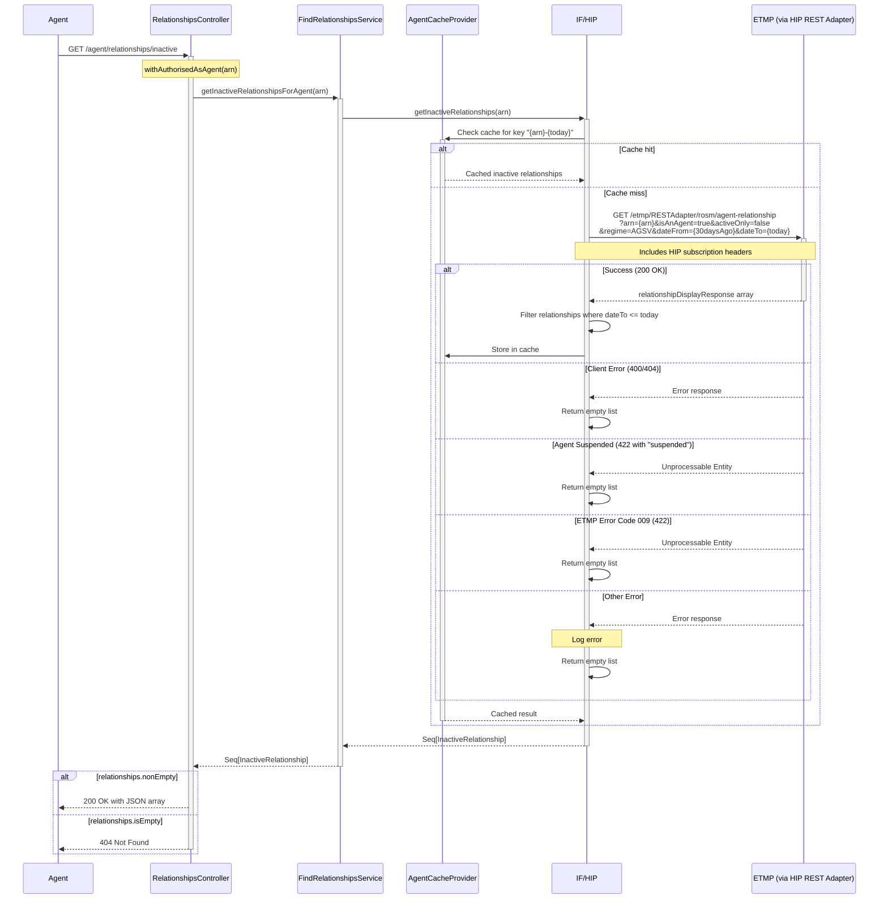

# ACR02: Get Inactive Agent Relationships

## Overview

Retrieves a list of all inactive (terminated) relationships for the authenticated agent from ETMP via HIP. This endpoint returns historical relationship data showing which client relationships have ended in the last 30 days (configurable). The endpoint filters relationships to only include those where the end date (`dateTo`) is on or before today, excluding any active relationships. Results are cached to improve performance for repeated requests.

## API Details

- **API ID**: ACR02
- **Method**: GET
- **Path**: `/agent/relationships/inactive`
- **Authentication**: Agent authentication via `withAuthorisedAsAgent`
- **Audience**: internal
- **Controller**: RelationshipsController
- **Controller Method**: `getInactiveRelationshipsAgent`

## Path Parameters

None

## Query Parameters

None

## Response

### Success Response (200 OK)

Returns a JSON array of inactive relationships:

```json
[
  {
    "arn": "TARN0000001",
    "dateTo": "2025-11-10",
    "dateFrom": "2024-01-15",
    "clientId": "XXIT00000000001",
    "clientType": "personal",
    "service": "HMRC-MTD-IT"
  },
  {
    "arn": "TARN0000001",
    "dateTo": "2025-11-08",
    "dateFrom": "2024-03-20",
    "clientId": "123456789",
    "clientType": "business",
    "service": "HMRC-MTD-VAT"
  }
]
```

### Error Responses

- **404 Not Found**: No inactive relationships found for the agent
- **401 Unauthorized**: Agent not authenticated

## Service Architecture

### Service Layer Components

1. **RelationshipsController (RC)**: Handles authentication and returns response
2. **FindRelationshipsService (FRS)**: Delegates to HIP connector
3. **HipConnector (HIP)**: Calls ETMP via HIP REST Adapter with caching
4. **AgentCacheProvider (Cache)**: Caches results by ARN and date

## Interaction Flow



## Dependencies

### External Services

- **IF/HIP**: HMRC Integration Platform - provides access to ETMP via REST Adapter
  - Endpoint: `/etmp/RESTAdapter/rosm/agent-relationship`
  - Requires HIP subscription headers
- **ETMP**: Enterprise Tax Management Platform - stores historical agent-client relationship records

### Internal Services

- **FindRelationshipsService**: Orchestrates the retrieval of inactive relationships
- **HipConnector**: Handles communication with ETMP via HIP REST Adapter
- **AgentCacheProvider**: Provides caching layer to reduce ETMP calls

### Database Collections

None - This endpoint queries ETMP directly, not MongoDB

## Response Model

### InactiveRelationship

| Field | Type | Description |
|-------|------|-------------|
| arn | String | Agent Reference Number (format: [A-Z]ARN[0-9]{7}) |
| dateTo | Optional[LocalDate] | Date relationship ended (must be ≤ today) |
| dateFrom | Optional[LocalDate] | Date relationship started |
| clientId | String | Client identifier - format varies by service (MTD-IT ID, VRN, UTR, CGT ref, PPT ref, CBC ID, URN, PLR ID) |
| clientType | String | Either "personal" or "business" - derived from ETMP response structure |
| service | String | Service identifier automatically determined from clientId format (e.g., HMRC-MTD-IT, HMRC-MTD-VAT, HMRC-TERS-ORG, HMRC-CGT-PD, HMRC-PPT-ORG, HMRC-CBC-ORG, HMRC-PILLAR2-ORG) |

### Service Determination Logic

The service field is automatically derived from the clientId format:

- **HMRC-CGT-PD**: clientId matches CGT reference regex
- **HMRC-PPT-ORG**: clientId is valid PPT reference
- **HMRC-CBC-ORG**: clientId is valid CBC ID
- **HMRC-MTD-VAT**: clientId is valid VRN
- **HMRC-TERS-ORG**: clientId is valid UTR
- **HMRC-TERSNT-ORG**: clientId is valid URN (for business clients)
- **HMRC-PILLAR2-ORG**: clientId is valid PLR ID
- **HMRC-MTD-IT**: clientId is valid MTD-IT ID

## Caching

- **Enabled**: Yes
- **Cache Provider**: AgentCacheProvider
- **Cache Key**: `{arn}-{today}` (e.g., "TARN0000001-2025-11-14")
- **Cache Duration**: Results are cached for the current day
- **Purpose**: Reduces load on ETMP by caching results for repeated requests on the same day

## Error Handling

### Client Errors (400, 404)

ETMP returns these when:
- ARN not found
- Invalid query parameters
- **Handling**: Returns empty list (controller returns 404)

### Agent Suspended (422)

ETMP returns 422 with message containing "suspended" when the agent's account is suspended.
- **Handling**: Returns empty list (controller returns 404)

### ETMP Error Code 009 (422)

ETMP returns 422 with error code "009" for specific ETMP validation errors.
- **Handling**: Returns empty list (controller returns 404)

### Other Errors

Any other error response from ETMP.
- **Handling**: Logs error and returns empty list (controller returns 404)

## Filtering Logic

The endpoint implements the `isNotActive` filter to ensure only genuinely inactive relationships are returned:

```scala
private def isNotActive(r: InactiveRelationship): Boolean =
  r.dateTo match {
    case None => false  // No end date means still active
    case Some(d) =>
      d.isBefore(Instant.now().atZone(ZoneOffset.UTC).toLocalDate) ||
      d.equals(Instant.now().atZone(ZoneOffset.UTC).toLocalDate)
  }
```

**Filter Criteria**:
- Relationships with no `dateTo` are **excluded** (still active)
- Relationships where `dateTo` is **before today** are **included**
- Relationships where `dateTo` **equals today** are **included**
- Relationships where `dateTo` is **after today** are **excluded**

## Configuration

### showInactiveRelationshipsDays

Configurable number of days to look back when querying ETMP.

- **Default**: 30 days
- **Effect**: ETMP query includes `dateFrom` parameter set to today minus this value
- **Example**: If set to 30, queries relationships from the last 30 days

## Performance Considerations

- **Caching**: Results cached per ARN per day significantly reduces ETMP calls
- **Date Range**: Querying only last N days (default 30) limits result set size
- **Filtering**: Client-side filtering ensures only truly inactive relationships are returned
- **Empty Response**: Returns 404 instead of empty array for consistency

## Notes

- Returns only relationships where `dateTo` is on or before today - active relationships are filtered out
- Results are cached per ARN per day to reduce load on ETMP
- Returns 404 if no inactive relationships found (empty list)
- Date range queried is configurable via `showInactiveRelationshipsDays` setting
- Service type is automatically determined from the clientId format
- Client type (personal/business) is derived from ETMP response structure
- Requires agent authentication - ARN is extracted from authenticated agent's enrolment
- The endpoint does not query MongoDB - all data comes from ETMP via HIP

