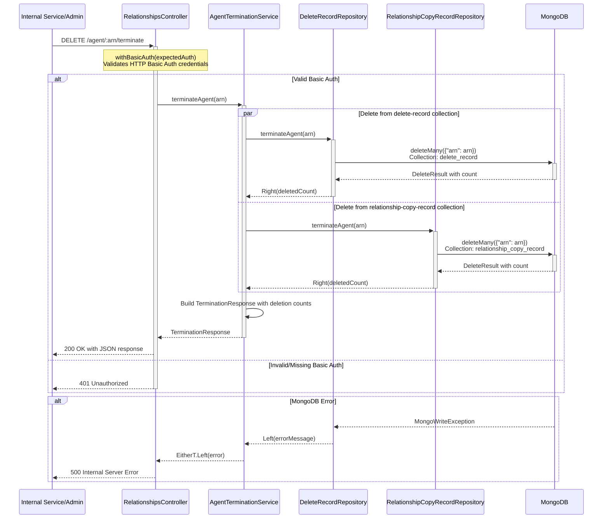

# ACR03: Terminate Agent - Clean Up Internal Records

## Overview

⚠️ **Important**: This endpoint does **NOT** terminate actual agent-client relationships in EACD. It is an administrative endpoint that only deletes internal housekeeping records from MongoDB.

This endpoint removes internal tracking records for a terminated agent from two MongoDB collections:
1. **delete_record** - Stores pending relationship deletion records
2. **relationship_copy_record** - Tracks which legacy CESA relationships have been copied to EACD

This is typically called as part of an agent termination workflow managed by other services, after the actual relationships have been terminated through other means.

## API Details

- **API ID**: ACR03
- **Method**: DELETE
- **Path**: `/agent/{arn}/terminate`
- **Authentication**: HTTP Basic Authentication (service-to-service)
- **Audience**: internal
- **Controller**: RelationshipsController
- **Controller Method**: `terminateAgent`

## Path Parameters

| Parameter | Type | Required | Description |
|-----------|------|----------|-------------|
| arn | String | Yes | Agent Reference Number in format [A-Z]ARN[0-9]{7} |

## Query Parameters

None

## Response

### Success Response (200 OK)

Returns a JSON object with deletion counts from each collection:

```json
{
  "counts": [
    {
      "service": "agent-client-relationships",
      "store": "delete-record",
      "count": 5
    },
    {
      "service": "agent-client-relationships",
      "store": "relationship-copy-record",
      "count": 12
    }
  ]
}
```

### Error Responses

- **401 Unauthorized**: Invalid or missing HTTP Basic Authentication credentials
- **500 Internal Server Error**: MongoDB write exception occurred during deletion

## Authentication

This endpoint uses **HTTP Basic Authentication**, NOT agent authentication or Stride authentication.

- **Header**: `Authorization: Basic {base64(username:password)}`
- **Credentials**: Configured in `appConfig.expectedAuth`
- **Purpose**: Service-to-service authentication for administrative operations

## Service Architecture

### Service Layer Components

1. **RelationshipsController (RC)**: Validates Basic Auth and returns response
2. **AgentTerminationService (ATS)**: Orchestrates parallel deletion from both collections
3. **DeleteRecordRepository (DRR)**: Handles delete_record collection operations
4. **RelationshipCopyRecordRepository (RCRR)**: Handles relationship_copy_record collection operations

## Interaction Flow



## Dependencies

### External Services

None - This endpoint does not call any external services

### Internal Services

- **AgentTerminationService**: Orchestrates the deletion process
- **DeleteRecordRepository**: MongoDB repository for delete_record collection
- **RelationshipCopyRecordRepository**: MongoDB repository for relationship_copy_record collection

### Database Collections

| Collection | Operation | Description |
|------------|-----------|-------------|
| delete_record | DELETE | Stores pending relationship deletion records - all documents for the ARN are deleted |
| relationship_copy_record | DELETE | Tracks copied legacy relationships from CESA to EACD - all documents for the ARN are deleted |

## Response Model

### TerminationResponse

| Field | Type | Description |
|-------|------|-------------|
| counts | Array[DeletionCount] | Array of deletion counts, one per collection |

### DeletionCount

| Field | Type | Description |
|-------|------|-------------|
| service | String | Always "agent-client-relationships" |
| store | String | Collection name ("delete-record" or "relationship-copy-record") |
| count | Int | Number of documents deleted from the collection |

## MongoDB Operations

### delete_record Collection

**Operation**: `deleteMany({"arn": "{arn}"})`

Removes all pending deletion tracking records for the agent. These records are used by the `CheckRelationshipsOrchestratorService` to track relationships that are in the process of being deleted.

### relationship_copy_record Collection

**Operation**: `deleteMany({"arn": "{arn}"})`

Removes all legacy relationship copy tracking records. These records track which legacy CESA relationships have been copied to EACD to avoid duplicate copying.

## Error Handling

### Authentication Errors

**Scenario**: Invalid or missing HTTP Basic Authentication credentials

- **Logged Warning**: "Authorization header found in the request but invalid username or password" or "No Authorization header found in the request for agent termination"
- **Response**: 401 Unauthorized
- **Note**: Credentials must exactly match `appConfig.expectedAuth`

### MongoDB Write Exceptions

**Scenario**: `MongoWriteException` thrown during deleteMany operations

- **Repository Handling**: Returns `Left(errorMessage)` with exception message
- **Service Handling**: Propagates error through EitherT monad
- **Controller Handling**: Logs warning and returns 500 Internal Server Error
- **Log Message**: "unexpected error during agent termination: {arn}, error = {error}"

## Parallel Execution

The service executes both repository deletions in **parallel** using Cats `EitherT` for efficient processing:

```scala
val drr = deleteRecordRepository.terminateAgent(arn)
val rcrr = relationshipCopyRecordRepository.terminateAgent(arn)
for {
  drrResult <- EitherT(drr)
  rcrrResult <- EitherT(rcrr)
  // ... build response
} yield result
```

Both deletions start simultaneously, and the service waits for both to complete before building the response.

## Important Notes

### What This Endpoint Does

✅ Deletes internal tracking records from MongoDB  
✅ Returns deletion counts for each collection  
✅ Uses HTTP Basic Authentication  
✅ Executes deletions in parallel for efficiency  
✅ Returns 200 OK even if 0 records deleted  

### What This Endpoint Does NOT Do

❌ Does **NOT** terminate actual agent-client relationships in EACD  
❌ Does **NOT** call EACD to de-allocate enrolments  
❌ Does **NOT** call any external services  
❌ Does **NOT** modify the invitations collection  
❌ Does **NOT** use agent or Stride authentication  

## Use Cases

This endpoint is intended for:

1. **Agent Termination Workflows**: Called as part of a larger agent termination process managed by other services
2. **Data Cleanup**: Removing internal housekeeping data after agent relationships have been terminated elsewhere
3. **Administrative Operations**: Service-to-service cleanup operations requiring Basic Auth

## Performance Considerations

- **Parallel Execution**: Both repository operations execute simultaneously for better performance
- **Bulk Deletion**: Uses MongoDB's `deleteMany` for efficient bulk operations
- **No External Calls**: No network latency from external service calls
- **Functional Error Handling**: EitherT monad provides clean error propagation without exceptions

## Common Misconceptions

| ❌ Wrong Understanding | ✅ Correct Understanding |
|----------------------|------------------------|
| This terminates active agent-client relationships | This only deletes internal tracking records |
| This calls EACD to de-allocate enrolments | This does not call any external services |
| This uses agent authentication | This uses HTTP Basic Authentication |
| This updates the invitations collection | This only touches delete_record and relationship_copy_record |
| This can be called from agent UIs | This is for service-to-service administrative calls only |

## Related Documentation

For actual relationship termination that affects EACD, see other endpoints that:
- Call `DeleteRelationshipsService` to remove relationships from EACD
- Update the invitations collection with ended dates
- De-allocate enrolments via EACD

---

## Document Metadata

**Last Updated:** 2025-11-20  
**Git Commit SHA:** `b2138b4e3958677748c1820c3d715d4fbb9d3b2c`  
**Analysis Version:** 1.0
