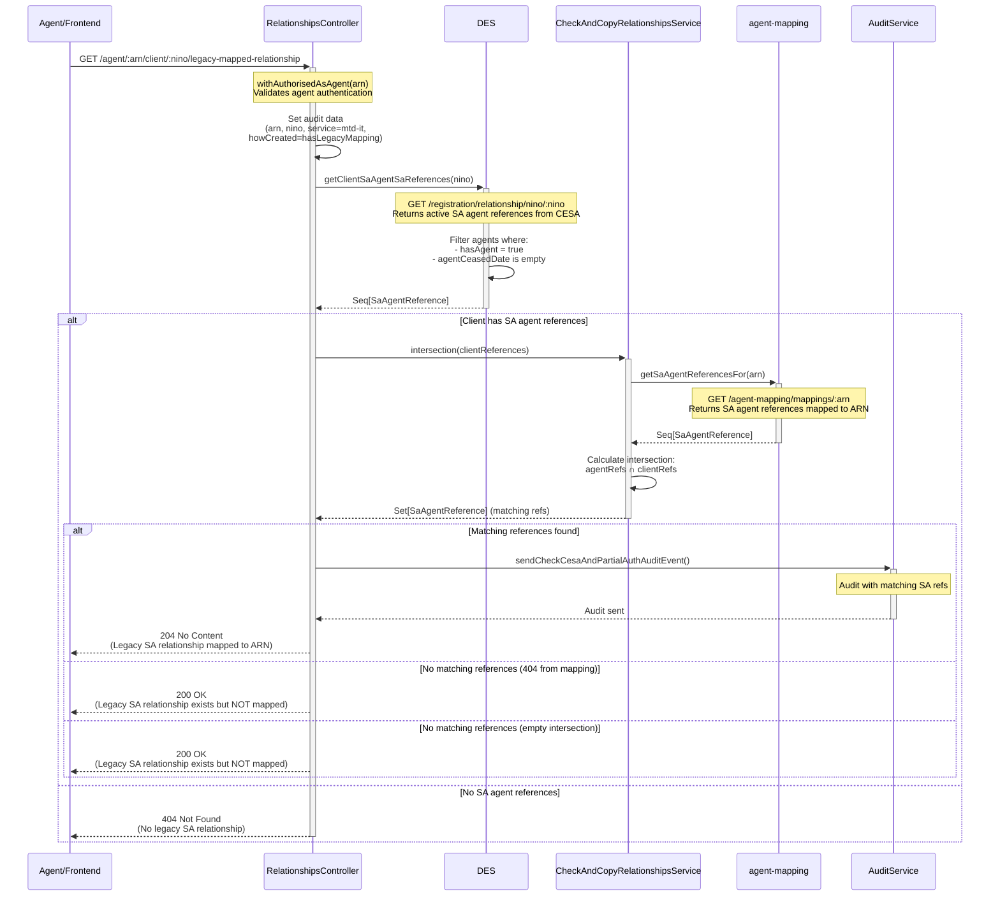

# ACR04: Check Legacy SA Relationship Mapping Status

## Overview

Checks if a client has a legacy Self Assessment (SA) relationship in CESA and whether that relationship has been mapped to the agent's modern ARN. This endpoint is used by **agent-invitations-frontend** to determine the status of legacy relationships during the invitation process.

The endpoint performs a two-stage check:
1. **CESA Check**: Does the client have any active SA agent relationships in the legacy system?
2. **Mapping Check**: If yes, has that legacy SA agent reference been mapped to this agent's ARN?

Different HTTP status codes indicate different scenarios to help the frontend handle legacy migration appropriately.

## API Details

- **API ID**: ACR04
- **Method**: GET
- **Path**: `/agent/{arn}/client/{nino}/legacy-mapped-relationship`
- **Authentication**: Agent authentication via `withAuthorisedAsAgent`
- **Audience**: internal
- **Controller**: RelationshipsController
- **Controller Method**: `getLegacySaRelationshipStatus`
- **Used By**: agent-invitations-frontend

## Path Parameters

| Parameter | Type | Required | Description |
|-----------|------|----------|-------------|
| arn | String | Yes | Agent Reference Number in format [A-Z]ARN[0-9]{7} |
| nino | String | Yes | Client's National Insurance Number |

## Query Parameters

None

## Response

### 204 No Content

**Meaning**: Legacy SA relationship found in CESA **AND** it is mapped to the agent's ARN

**Business Logic**: `clientRefs.nonEmpty AND (clientRefs ∩ agentMappedRefs).nonEmpty`

**Frontend Action**: Agent can access the client through their legacy mapping - may show "existing relationship" message

**Audit**: Sends `CheckCesaAndPartialAuth` audit event with matching SA references

### 200 OK

**Meaning**: Legacy SA relationship found in CESA but **NOT** mapped to the agent's ARN

**Business Logic**: `clientRefs.nonEmpty AND ((clientRefs ∩ agentMappedRefs).isEmpty OR mapping service 404)`

**Frontend Action**: Legacy relationship exists but agent needs to establish a new modern relationship

### 404 Not Found

**Meaning**: No legacy SA relationship found in CESA for this client

**Business Logic**: `clientRefs.isEmpty`

**Frontend Action**: Proceed with new invitation flow (no legacy migration concerns)

### 401 Unauthorized

**Meaning**: Agent authentication failed

## Service Architecture

### Service Layer Components

1. **RelationshipsController (RC)**: Handles authentication and orchestrates the check
2. **DesConnector (DES)**: Queries CESA for client's SA agent references
3. **CheckAndCopyRelationshipsService (CACRS)**: Calculates intersection of references
4. **MappingConnector (AM)**: Retrieves SA references mapped to the ARN
5. **AuditService**: Sends audit events when mapped relationship found

## Interaction Flow



## Dependencies

### External Services

- **DES/ETMP**: Data Exchange Service - stores legacy CESA SA agent relationships
  - Endpoint: `/registration/relationship/nino/{nino}`
  - Returns: Agent relationship data with SA agent references
- **agent-mapping**: Service that maintains mappings between modern ARNs and legacy SA agent references
  - Endpoint: `/agent-mapping/mappings/{arn}`
  - Returns: SA agent references that have been mapped to the ARN

### Internal Services

- **DesConnector**: Handles communication with DES/CESA
- **CheckAndCopyRelationshipsService**: Provides intersection logic
- **MappingConnector**: Handles communication with agent-mapping
- **AuditService**: Sends audit events

### Database Collections

None - This endpoint queries external services only

## Business Logic

### CESA Filtering

DES returns all agent relationships for the NINO, but the connector filters to only include **active** relationships:

```scala
.filter(agent => agent.hasAgent && agent.agentCeasedDate.isEmpty)
```

**Criteria**:
- `hasAgent = true`: Agent relationship exists
- `agentCeasedDate.isEmpty`: Agent relationship has not ended

### Intersection Logic

The `intersection` method in CheckAndCopyRelationshipsService:

1. Converts client's SA references to a Set
2. Calls agent-mapping to get agent's mapped SA references
3. Calculates the intersection: `agentRefs.toSet ∩ clientRefs.toSet`
4. Returns the Set of matching references

**Example**:
- Client has SA refs in CESA: `[SA6012, SA7123]`
- Agent has mapped refs: `[SA6012, SA9999]`
- Intersection: `[SA6012]` (non-empty) → **204 No Content**

### Response Determination

```
IF clientRefs.isEmpty THEN
    return 404 (no legacy relationship)
ELSE IF (clientRefs ∩ agentMappedRefs).nonEmpty THEN
    audit event
    return 204 (relationship mapped)
ELSE IF mapping service returns 404 THEN
    return 200 (relationship not mapped)
ELSE IF intersection is empty THEN
    return 200 (relationship not mapped)
END IF
```

## Audit Event

### When Triggered

Only when a **mapped legacy relationship is found** (204 response)

### Event Name

`CheckCesaAndPartialAuth`

### Audit Data

| Field | Value |
|-------|-------|
| arn | Agent Reference Number |
| nino | Client's NINO |
| service | Always "mtd-it" |
| clientIdType | Always "nino" |
| howRelationshipCreated | Always "hasLegacyMapping" |
| saAgentRef | Comma-separated matching SA agent references |
| cesaRelationship | true |

## Error Handling

### DES Returns Non-200 Status

- **Logged**: "Error in GetStatusAgentRelationship. {status}, {body}"
- **Handling**: Returns empty Seq (treated as no legacy relationship)
- **Result**: 404 Not Found

### agent-mapping Returns 404

- **Handling**: Caught in `.recover { case e: UpstreamErrorResponse if e.statusCode == 404 => Ok }`
- **Result**: 200 OK (relationship exists but not mapped)

### agent-mapping Returns Other Error

- **Logged**: "Error in Digital-Mappings getSaAgentReferences: {status}, {body}"
- **Handling**: Returns empty Seq (treated as no mapping)
- **Result**: 200 OK (relationship exists but not mapped)

### Agent Authentication Fails

- **Handling**: `withAuthorisedAsAgent` returns 401
- **Result**: 401 Unauthorized

## Use Cases

### 1. Agent Inviting Client with Mapped Legacy Relationship

**Scenario**: Agent tries to invite client who already has a legacy SA relationship mapped to their ARN

**Flow**:
1. DES returns client's SA agent refs: `[SA6012]`
2. agent-mapping returns agent's mapped refs: `[SA6012, SA7000]`
3. Intersection: `[SA6012]` (non-empty)

**Response**: 204 No Content

**Frontend Action**: Show message like "You already have access to this client through a legacy relationship"

### 2. Agent Inviting Client with Unmapped Legacy Relationship

**Scenario**: Client has legacy SA relationship but it's not mapped to this agent's ARN

**Flow**:
1. DES returns client's SA agent refs: `[SA5555]`
2. agent-mapping returns agent's mapped refs: `[SA6012, SA7000]`
3. Intersection: `[]` (empty)

**Response**: 200 OK

**Frontend Action**: Proceed with invitation, but may show message about migrating legacy relationship

### 3. Agent Inviting New Client

**Scenario**: Client has no legacy SA relationships in CESA

**Flow**:
1. DES returns empty Seq (no SA agent refs)

**Response**: 404 Not Found

**Frontend Action**: Proceed with standard new invitation flow

## Important Notes

- ✅ **SA-Specific**: This endpoint only checks Self Assessment (SA) relationships, not other tax regimes
- ✅ **CESA Legacy System**: Queries the old CESA system, not the modern EACD system
- ✅ **Active Relationships Only**: Only considers active agent relationships (not ceased)
- ✅ **Audit on Success**: Audit event only sent when mapped relationship confirmed (204)
- ✅ **Used by Frontend**: Primary consumer is agent-invitations-frontend during invitation flow
- ⚠️ **No Data Modification**: This is a read-only check - it doesn't create or update any relationships
- ⚠️ **ARN Mapping Required**: Agent must have their SA agent references mapped to their ARN in agent-mapping service

## Response Code Summary

| Code | Client Has Legacy SA Rel? | Mapped to Agent's ARN? | Frontend Action |
|------|---------------------------|------------------------|-----------------|
| 204 | ✅ Yes | ✅ Yes | Show existing relationship message |
| 200 | ✅ Yes | ❌ No | Proceed with invitation (may migrate) |
| 404 | ❌ No | N/A | Standard new invitation flow |
| 401 | N/A | N/A | Authentication error |

## Related Documentation

- **ACR01**: Check modern agent-client relationships in EACD
- **agent-mapping service**: Maintains ARN to legacy SA reference mappings
- **DES/CESA**: Legacy tax system storing SA agent relationships

---

## Document Metadata

**Last Updated:** 2025-11-20  
**Git Commit SHA:** `b2138b4e3958677748c1820c3d715d4fbb9d3b2c`  
**Analysis Version:** 1.0
