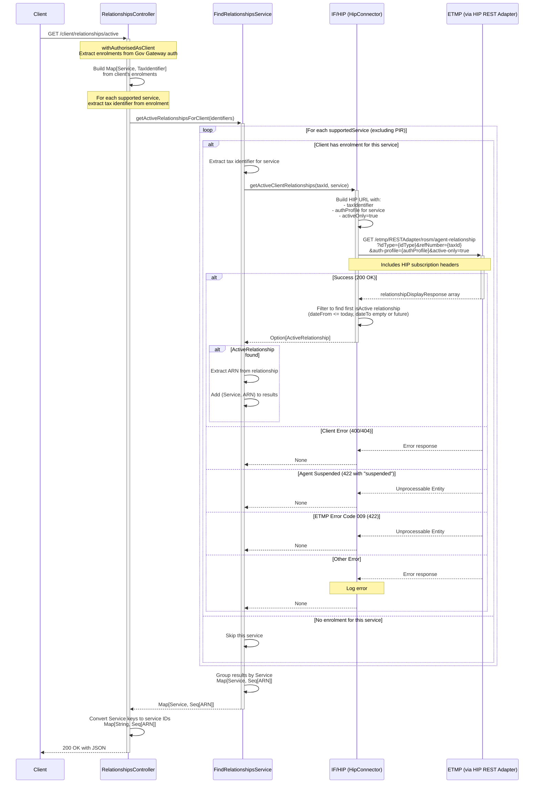

# ACR05: Get Client Active Relationships

## Overview

Retrieves all active agent-client relationships for the authenticated client across all their enrolled services (excluding PIR). This endpoint enables clients to see which agents currently have access to their tax affairs across different HMRC services.

The endpoint:
1. Authenticates the client via Government Gateway
2. Extracts tax identifiers from all the client's enrolments
3. Queries ETMP via HIP for active agent relationships for each service
4. Returns a map of service IDs to arrays of agent ARNs

This provides a comprehensive view of all the client's active agent relationships in a single call.

## API Details

- **API ID**: ACR05
- **Method**: GET
- **Path**: `/client/relationships/active`
- **Authentication**: Client authentication via Government Gateway (Individual or Organisation)
- **Audience**: internal
- **Controller**: RelationshipsController
- **Controller Method**: `getActiveRelationshipsForClient`

## Path Parameters

None

## Query Parameters

None

## Response

### Success Response (200 OK)

Returns a JSON map with service IDs as keys and arrays of agent ARNs as values:

```json
{
  "HMRC-MTD-IT": ["TARN0000001", "TARN0000002"],
  "HMRC-MTD-VAT": ["TARN0000001"],
  "HMRC-CGT-PD": ["TARN0000003"],
  "HMRC-TERS-ORG": []
}
```

**Empty Response** (client has no active relationships):
```json
{}
```

### Error Responses

- **401 Unauthorized**: Client not authenticated via Government Gateway
- **403 Forbidden**: User has no supported service enrolments (NoPermissionToPerformOperation)

## Authentication

### Requirements

- **Provider**: GovernmentGateway
- **Affinity Groups**: Individual OR Organisation
- **Enrolments**: At least one supported service enrolment required
- **Retrieval**: Retrieves `allEnrolments` from auth

### Supported Services

The endpoint checks for these services (excluding PIR):

- HMRC-MTD-IT (Making Tax Digital for Income Tax)
- HMRC-MTD-IT-SUPP (MTD-IT Supporting)
- HMRC-MTD-VAT (Making Tax Digital for VAT)
- HMRC-TERS-ORG (Trusts and Estates)
- HMRC-TERSNT-ORG (Trusts and Estates Non-Taxable)
- HMRC-CGT-PD (Capital Gains Tax)
- HMRC-PPT-ORG (Plastic Packaging Tax)
- HMRC-CBC-ORG (Country by Country)
- HMRC-PILLAR2-ORG (Pillar 2)

### Excluded Services

**PERSONAL-INCOME-RECORD (PIR)**: Handled by separate agent-fi-relationship service

## Service Architecture

### Service Layer Components

1. **RelationshipsController (RC)**: Authenticates client, extracts enrolments, formats response
2. **FindRelationshipsService (FRS)**: Orchestrates parallel lookups across all services
3. **HipConnector (HIP)**: Queries ETMP via HIP REST Adapter for each service

## Interaction Flow



## Dependencies

### External Services

- **IF/HIP**: HMRC Integration Platform - provides access to ETMP agent relationships
  - Endpoint pattern: `/etmp/RESTAdapter/rosm/agent-relationship`
  - Query parameters: `idType`, `refNumber`, `auth-profile`, `active-only=true`
- **ETMP**: Enterprise Tax Management Platform - stores agent-client relationship records

### Internal Services

- **FindRelationshipsService**: Orchestrates relationship lookups across services
- **HipConnector**: Handles communication with ETMP via HIP

### Database Collections

None - This endpoint queries external services only

## Business Logic

### Enrolment Extraction

```scala
val identifiers =
  for {
    supportedService <- supportedServices
    enrolment <- enrolments.getEnrolment(supportedService.enrolmentKey)
    clientId <- enrolment.identifiers.headOption
  } yield (supportedService, supportedService.supportedClientIdType.createUnderlying(clientId.value))
```

**Process**:
1. Iterate through all supported services
2. Check if client has enrolment for each service
3. Extract first tax identifier from enrolment
4. Create (Service, TaxIdentifier) tuple

**Example**: Client with MTD-IT and VAT enrolments:
- `HMRC-MTD-IT` → Extract MTDITID → `(Service.MtdIt, MtdItId("XXIT00000000001"))`
- `HMRC-MTD-VAT` → Extract VRN → `(Service.Vat, Vrn("123456789"))`

### Service Traversal

Uses `Future.traverse` to query all services **in parallel**:

```scala
Future.traverse(appConfig.supportedServicesWithoutPir) { service =>
  identifiers.get(service) match {
    case Some(taxId) => getActiveRelationshipsForClient(taxId, service)
    case None => Future.successful(None)
  }
}
```

**Benefits**:
- Parallel execution improves performance
- Services without enrolments return None immediately
- Failed lookups don't block other services

### Active Relationship Filtering

HIP connector filters ETMP response to find active relationships:

```scala
.find(isActive)
```

**Active Criteria** (in `isActive` method):
- `dateFrom` <= today
- `dateTo` is empty (None) OR in the future

**Note**: ETMP already filters with `active-only=true`, but client-side filtering provides additional verification.

### Result Grouping

```scala
.groupBy(_._1)  // Group by Service
.map { case (k, v) => (k, v.map(_._2)) }  // Extract ARNs
```

**Example**:
- Input: `[(Service.MtdIt, ARN1), (Service.MtdIt, ARN2), (Service.Vat, ARN1)]`
- Output: `Map(Service.MtdIt -> Seq(ARN1, ARN2), Service.Vat -> Seq(ARN1))`

## Auth Profile Mapping

Each service requires a specific `auth-profile` parameter for ETMP:

| Service | Auth Profile |
|---------|--------------|
| HMRC-MTD-IT | ITSA |
| HMRC-MTD-IT-SUPP | ITSA |
| HMRC-MTD-VAT | VATC |
| HMRC-TERS-ORG | TRS |
| HMRC-TERSNT-ORG | TRSNT |
| HMRC-CGT-PD | CGT |
| HMRC-PPT-ORG | PPT |
| HMRC-CBC-ORG | CBC |
| HMRC-PILLAR2-ORG | PLR |

## Error Handling

### ETMP Errors

| Status | Condition | Handling | Result |
|--------|-----------|----------|--------|
| 400, 404 | Client/relationship not found | Returns None | Service omitted from response |
| 422 | Message contains "suspended" | Agent suspended | Returns None |
| 422 | Message contains "009" | ETMP error code | Returns None |
| Other | Any other error | Logs error, returns None | Service omitted from response |

### Authentication Errors

**No Enrolments** (empty identifiers map):
- Returns 403 Forbidden with `NoPermissionToPerformOperation`
- Client must have at least one supported service enrolment

**Not Authenticated**:
- Returns 401 Unauthorized
- Must be authenticated via Government Gateway as Individual or Organisation

## Response Examples

### Client with Multiple Services and Agents

```json
{
  "HMRC-MTD-IT": ["TARN0000001", "TARN0000002"],
  "HMRC-MTD-VAT": ["TARN0000001"],
  "HMRC-CGT-PD": ["TARN0000003"]
}
```

**Interpretation**:
- Client has 2 agents for MTD-IT
- Client has 1 agent for VAT (same agent as one of the MTD-IT agents)
- Client has 1 agent for CGT
- Client has no relationships for other enrolled services

### Client with No Relationships

```json
{}
```

**Interpretation**:
- Client is enrolled for services but has no active agent relationships
- Returns 200 OK (not 404)

### Client with Partial Errors

```json
{
  "HMRC-MTD-IT": ["TARN0000001"]
}
```

**Interpretation**:
- MTD-IT lookup succeeded
- Other services may have failed or have no relationships
- Services with errors are omitted from response

## Use Cases

### 1. Client Dashboard

**Scenario**: Client wants to see all their current agents

**Response**:
```json
{
  "HMRC-MTD-IT": ["TARN0000001"],
  "HMRC-MTD-VAT": ["TARN0000001"]
}
```

**Frontend Action**: Display agent details with access levels per service

### 2. Before Authorising New Agent

**Scenario**: Client checking if they already have an agent before authorising a new one

**Response**:
```json
{
  "HMRC-MTD-IT": ["TARN0000001"]
}
```

**Frontend Action**: Show warning "You already have an agent for MTD-IT. Authorising a new agent will..."

### 3. Client with No Agents

**Scenario**: New client or client who has removed all agents

**Response**:
```json
{}
```

**Frontend Action**: Show message "You have no authorised agents" with option to authorise

## Important Notes

- ✅ **Active Only**: Returns only active relationships - ended relationships excluded
- ✅ **PIR Excluded**: Personal Income Record handled separately by agent-fi-relationship service
- ✅ **Enrolments Required**: Client must have at least one supported service enrolment
- ✅ **Parallel Execution**: All services queried in parallel for performance
- ✅ **Empty Map**: Returns 200 OK with `{}` if no relationships (not 404)
- ✅ **Multiple Agents**: Each service can have multiple agent relationships
- ✅ **ETMP Filtering**: `active-only=true` ensures ETMP returns only active relationships
- ✅ **Service-Specific Auth**: Each service uses different auth-profile parameter
- ⚠️ **Government Gateway Only**: Requires Individual or Organisation affinity group
- ⚠️ **No Service Details**: Response only includes ARNs, not agent names or other details

## Performance Considerations

- **Parallel Execution**: `Future.traverse` executes all service lookups simultaneously
- **Short-Circuit**: Services without enrolments skip ETMP calls
- **Error Isolation**: Failed lookups don't affect other services
- **No Caching**: Each request queries ETMP in real-time

## Related Documentation

- **ACR06**: Get client inactive relationships
- **ACR07**: Get relationship for specific service
- **agent-fi-relationship**: Handles PIR relationships

