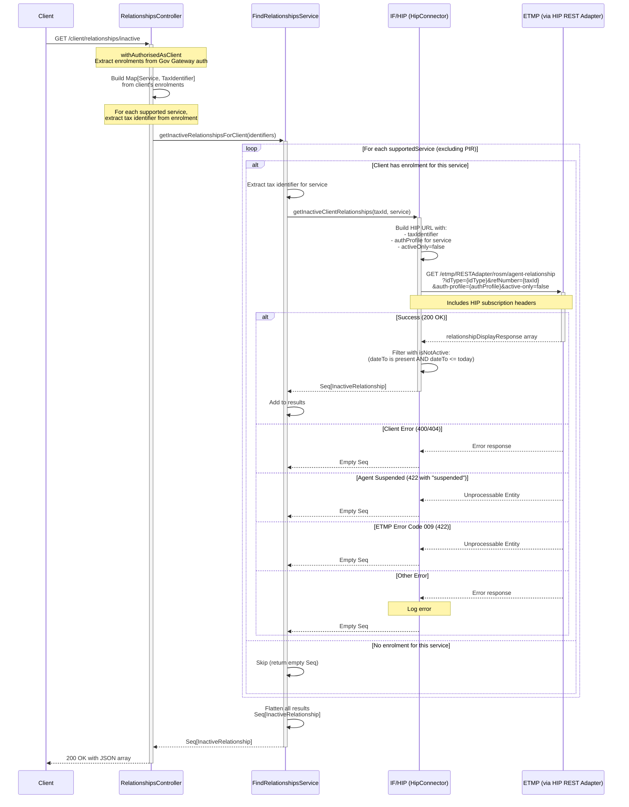

# ACR06: Get Client Inactive Relationships

## Overview

Retrieves all inactive (terminated) agent-client relationships for the authenticated client across all their enrolled services (excluding PIR). This endpoint provides clients with a comprehensive view of their historical agent authorizations - showing which agents previously had access to their tax affairs and when those relationships ended.

The endpoint:
1. Authenticates the client via Government Gateway
2. Extracts tax identifiers from all the client's enrolments
3. Queries ETMP via HIP for inactive agent relationships for each service
4. Filters to only relationships that have genuinely ended (dateTo <= today)
5. Returns a flat array of all inactive relationships across all services

This is the client-side equivalent of ACR02 (which provides the agent-side view).

## API Details

- **API ID**: ACR06
- **Method**: GET
- **Path**: `/client/relationships/inactive`
- **Authentication**: Client authentication via Government Gateway (Individual or Organisation)
- **Audience**: internal
- **Controller**: RelationshipsController
- **Controller Method**: `getInactiveRelationshipsForClient`

## Path Parameters

None

## Query Parameters

None

## Response

### Success Response (200 OK)

Returns a JSON array of inactive relationships:

```json
[
  {
    "arn": "TARN0000001",
    "dateTo": "2025-10-15",
    "dateFrom": "2024-01-20",
    "clientId": "XXIT00000000001",
    "clientType": "personal",
    "service": "HMRC-MTD-IT"
  },
  {
    "arn": "TARN0000002",
    "dateTo": "2025-11-01",
    "dateFrom": "2023-05-10",
    "clientId": "123456789",
    "clientType": "business",
    "service": "HMRC-MTD-VAT"
  }
]
```

**Empty Response** (client has no inactive relationships):
```json
[]
```

### Error Responses

- **401 Unauthorized**: Client not authenticated via Government Gateway
- **403 Forbidden**: User has no supported service enrolments (NoPermissionToPerformOperation)

## Authentication

### Requirements

- **Provider**: GovernmentGateway
- **Affinity Groups**: Individual OR Organisation
- **Enrolments**: At least one supported service enrolment required
- **Retrieval**: Retrieves `allEnrolments` from auth

### Supported Services

The endpoint checks for these services (excluding PIR):

- HMRC-MTD-IT (Making Tax Digital for Income Tax)
- HMRC-MTD-IT-SUPP (MTD-IT Supporting)
- HMRC-MTD-VAT (Making Tax Digital for VAT)
- HMRC-TERS-ORG (Trusts and Estates)
- HMRC-TERSNT-ORG (Trusts and Estates Non-Taxable)
- HMRC-CGT-PD (Capital Gains Tax)
- HMRC-PPT-ORG (Plastic Packaging Tax)
- HMRC-CBC-ORG (Country by Country)
- HMRC-PILLAR2-ORG (Pillar 2)

### Excluded Services

**PERSONAL-INCOME-RECORD (PIR)**: Handled by separate agent-fi-relationship service

## Service Architecture

### Service Layer Components

1. **RelationshipsController (RC)**: Authenticates client, extracts enrolments, returns response
2. **FindRelationshipsService (FRS)**: Orchestrates parallel lookups across all services
3. **HipConnector (HIP)**: Queries ETMP via HIP REST Adapter for each service

## Interaction Flow



## Dependencies

### External Services

- **IF/HIP**: HMRC Integration Platform - provides access to ETMP agent relationships
  - Endpoint pattern: `/etmp/RESTAdapter/rosm/agent-relationship`
  - Query parameters: `idType`, `refNumber`, `auth-profile`, `active-only=false`
- **ETMP**: Enterprise Tax Management Platform - stores historical agent-client relationship records

### Internal Services

- **FindRelationshipsService**: Orchestrates relationship lookups across services
- **HipConnector**: Handles communication with ETMP via HIP

### Database Collections

None - This endpoint queries external services only (not MongoDB)

## Response Model

### InactiveRelationship

| Field | Type | Description |
|-------|------|-------------|
| arn | String | Agent Reference Number (format: [A-Z]ARN[0-9]{7}) |
| dateTo | Optional[LocalDate] | Date relationship ended (must be ≤ today to be included) |
| dateFrom | Optional[LocalDate] | Date relationship started |
| clientId | String | Client identifier - format varies by service |
| clientType | String | Either "personal" or "business" - derived from ETMP response |
| service | String | Service identifier (HMRC-MTD-IT, HMRC-MTD-VAT, etc.) - derived from clientId |

### Service Determination

The service field is automatically derived from the clientId format (same logic as ACR02):

- **HMRC-CGT-PD**: clientId matches CGT reference regex
- **HMRC-PPT-ORG**: clientId is valid PPT reference
- **HMRC-CBC-ORG**: clientId is valid CBC ID
- **HMRC-MTD-VAT**: clientId is valid VRN
- **HMRC-TERS-ORG**: clientId is valid UTR
- **HMRC-TERSNT-ORG**: clientId is valid URN (for business clients)
- **HMRC-PILLAR2-ORG**: clientId is valid PLR ID
- **HMRC-MTD-IT**: clientId is valid MTD-IT ID

## Business Logic

### Enrolment Extraction

Same as ACR05 - extracts tax identifiers from client's Government Gateway enrolments for all supported services.

### Service Traversal

Uses `Future.traverse` to query all services **in parallel**:

```scala
Future.traverse(appConfig.supportedServicesWithoutPir) { service =>
  identifiers.get(service) match {
    case Some(taxId) => getInactiveClientRelationships(taxId, service)
    case None => Future.successful(Seq.empty)
  }
}
.map(_.flatten)
```

**Benefits**:
- Parallel execution improves performance
- Services without enrolments return empty Seq immediately
- Failed lookups don't block other services
- Results are flattened into single array

### Inactive Relationship Filtering

HIP connector filters ETMP response using `isNotActive`:

```scala
private[connectors] def isNotActive(r: InactiveRelationship): Boolean =
  r.dateTo match {
    case None => false  // No end date means still active
    case Some(d) =>
      d.isBefore(Instant.now().atZone(ZoneOffset.UTC).toLocalDate) ||
      d.equals(Instant.now().atZone(ZoneOffset.UTC).toLocalDate)
  }
```

**Criteria**:
- Relationships with no `dateTo` are **excluded** (still active)
- Relationships where `dateTo` is **before today** are **included**
- Relationships where `dateTo` **equals today** are **included**
- Relationships where `dateTo` is **after today** are **excluded**

**Note**: ETMP is queried with `activeOnly=false` to get all relationships, then client-side filtering ensures only genuinely inactive ones are returned.

### Result Flattening

Results from all services are combined into a single flat array:

```scala
.map(_.flatten)
```

**Example**:
- MTD-IT returns: `[InactiveRel1, InactiveRel2]`
- VAT returns: `[InactiveRel3]`
- CGT returns: `[]`
- Final result: `[InactiveRel1, InactiveRel2, InactiveRel3]`

## Auth Profile Mapping

Same as ACR05 - each service requires a specific `auth-profile` parameter:

| Service | Auth Profile |
|---------|--------------|
| HMRC-MTD-IT | ITSA |
| HMRC-MTD-IT-SUPP | ITSA |
| HMRC-MTD-VAT | VATC |
| HMRC-TERS-ORG | TRS |
| HMRC-TERSNT-ORG | TRSNT |
| HMRC-CGT-PD | CGT |
| HMRC-PPT-ORG | PPT |
| HMRC-CBC-ORG | CBC |
| HMRC-PILLAR2-ORG | PLR |

## Error Handling

### ETMP Errors

| Status | Condition | Handling | Result |
|--------|-----------|----------|--------|
| 400, 404 | Client/relationship not found | Returns empty Seq | Service contributes nothing to results |
| 422 | Message contains "suspended" | Agent suspended | Returns empty Seq |
| 422 | Message contains "009" | ETMP error code | Returns empty Seq |
| Other | Any other error | Logs error, returns empty Seq | Service contributes nothing to results |

### Authentication Errors

**No Enrolments** (empty identifiers map):
- Returns 403 Forbidden with `NoPermissionToPerformOperation`
- Client must have at least one supported service enrolment

**Not Authenticated**:
- Returns 401 Unauthorized
- Must be authenticated via Government Gateway as Individual or Organisation

## Use Cases

### 1. Client Viewing Relationship History

**Scenario**: Client wants to see all their past agent authorizations

**Response**:
```json
[
  {
    "arn": "TARN0000001",
    "dateTo": "2025-10-15",
    "dateFrom": "2024-01-20",
    "clientId": "XXIT00000000001",
    "clientType": "personal",
    "service": "HMRC-MTD-IT"
  },
  {
    "arn": "TARN0000002",
    "dateTo": "2025-09-30",
    "dateFrom": "2023-03-15",
    "clientId": "123456789",
    "clientType": "business",
    "service": "HMRC-MTD-VAT"
  }
]
```

**Frontend Action**: Display timeline of past agent relationships with end dates

### 2. Client Auditing Previous Agent Access

**Scenario**: Client checking which agents had access in the past year

**Response**: Array of inactive relationships with dateTo in last year

**Frontend Action**: Show audit trail of agent access history

### 3. Client with No Historical Relationships

**Scenario**: New client or client who never terminated any relationships

**Response**:
```json
[]
```

**Frontend Action**: Show message "No terminated agent relationships"

## Comparison with ACR02

### Similarities

- Both query ETMP via HIP for inactive relationships
- Both use `isNotActive` filtering (dateTo present and <= today)
- Both use same `InactiveRelationship` model
- Both use service-specific auth profiles
- Both query with `activeOnly=false` then filter client-side

### Differences

| Aspect | ACR02 (Agent View) | ACR06 (Client View) |
|--------|-------------------|---------------------|
| **Perspective** | Agent looking at their clients | Client looking at their agents |
| **Authentication** | Agent authentication (withAuthorisedAsAgent) | Client authentication (withAuthorisedAsClient) |
| **Query Scope** | Single ETMP query with ARN | Multiple ETMP queries (one per service) |
| **Input** | ARN (from path parameter) | Tax identifiers (from enrolments) |
| **Response Structure** | Array of client relationships | Array of agent relationships |
| **Services Queried** | All services for that agent | Only services client is enrolled for |
| **Execution** | Single call | Parallel calls per enrolled service |

## Important Notes

- ✅ **Inactive Only**: Returns only terminated relationships - active relationships excluded by isNotActive filter
- ✅ **PIR Excluded**: Personal Income Record handled separately by agent-fi-relationship service
- ✅ **Enrolments Required**: Client must have at least one supported service enrolment
- ✅ **Parallel Execution**: All services queried in parallel for performance
- ✅ **Empty Array**: Returns 200 OK with `[]` if no inactive relationships (not 404)
- ✅ **Cross-Service**: Combines inactive relationships from all enrolled services in flat array
- ✅ **ETMP Query**: Uses `activeOnly=false` to get all relationships, then filters to inactive
- ✅ **Service-Specific Auth**: Each service uses different auth-profile parameter
- ✅ **Auto Service Detection**: Service field automatically derived from clientId format
- ✅ **End Date Filter**: Only includes relationships where dateTo <= today (future end dates excluded)
- ⚠️ **Government Gateway Only**: Requires Individual or Organisation affinity group
- ⚠️ **No Agent Details**: Response only includes ARNs, not agent names or other details

## Performance Considerations

- **Parallel Execution**: `Future.traverse` executes all service lookups simultaneously
- **Short-Circuit**: Services without enrolments skip ETMP calls
- **Error Isolation**: Failed lookups don't affect other services
- **No Caching**: Each request queries ETMP in real-time
- **Result Flattening**: Efficient Scala collection operations

## Related Documentation

- **ACR02**: Get agent inactive relationships (agent-side view of terminated relationships)
- **ACR05**: Get client active relationships (active agent relationships for client)
- **agent-fi-relationship**: Handles PIR inactive relationships

## Common Misconceptions

| ❌ Wrong Understanding | ✅ Correct Understanding |
|----------------------|------------------------|
| Queries MongoDB invitations collection | Queries ETMP via HIP/REST Adapter |
| Returns relationships from invitations table | Returns relationships from ETMP historical records |
| Only shows formally terminated invitations | Shows all ETMP relationships where dateTo <= today |
| Requires specific date range parameter | Returns all inactive relationships (filtered by dateTo) |

---

## Document Metadata

**Last Updated:** 2025-11-20  
**Git Commit SHA:** `b2138b4e3958677748c1820c3d715d4fbb9d3b2c`  
**Analysis Version:** 1.0
