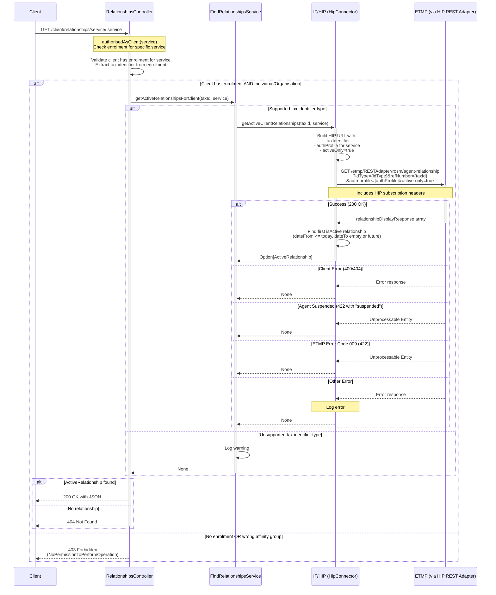

# ACR07: Get Client Relationship for Specific Service

## Overview

Retrieves the active agent relationship for a specific service for the authenticated client. This is a focused version of ACR05 that queries only one specific service instead of all enrolled services.

The endpoint:
1. Validates the client has an enrolment for the requested service
2. Extracts the tax identifier from that specific enrolment
3. Queries ETMP via HIP to find the active agent relationship
4. Returns the ActiveRelationship if one exists, or 404 if not

This provides a lightweight way for clients to check agent authorization for a single tax service.

## API Details

- **API ID**: ACR07
- **Method**: GET
- **Path**: `/client/relationships/service/{service}`
- **Authentication**: Client authentication via Government Gateway with specific service enrolment
- **Audience**: internal
- **Controller**: RelationshipsController
- **Controller Method**: `getRelationshipsByServiceViaClient`

## Path Parameters

| Parameter | Type | Required | Description |
|-----------|------|----------|-------------|
| service | String | Yes | Service identifier (e.g., HMRC-MTD-IT, HMRC-MTD-VAT, HMRC-TERS-ORG, HMRC-CGT-PD) |

## Query Parameters

None

## Response

### Success Response (200 OK)

Returns a JSON ActiveRelationship object:

```json
{
  "arn": "TARN0000001",
  "dateFrom": "2024-01-15",
  "dateTo": null,
  "clientId": "XXIT00000000001",
  "service": "HMRC-MTD-IT"
}
```

### Error Responses

- **404 Not Found**: No active relationship for this service
- **403 Forbidden**: Client not enrolled for this service or wrong affinity group
- **401 Unauthorized**: Client not authenticated via Government Gateway

## Authentication

### Requirements

- **Provider**: GovernmentGateway
- **Affinity Groups**: Individual OR Organisation
- **Enrolment**: Must have enrolment for the **specific service** in the path parameter
- **Retrieval**: Retrieves `authorisedEnrolments` and `affinityGroup`

**Key Difference from ACR05**: Uses `authorisedAsClient(service)` which checks for a **specific service enrolment**, not just any enrolment.

### Supported Services

- HMRC-MTD-IT (Making Tax Digital for Income Tax)
- HMRC-MTD-IT-SUPP (MTD-IT Supporting)
- HMRC-MTD-VAT (Making Tax Digital for VAT)
- HMRC-TERS-ORG (Trusts and Estates)
- HMRC-TERSNT-ORG (Trusts and Estates Non-Taxable)
- HMRC-CGT-PD (Capital Gains Tax)
- HMRC-PPT-ORG (Plastic Packaging Tax)
- HMRC-CBC-ORG (Country by Country)
- HMRC-PILLAR2-ORG (Pillar 2)

### Excluded Services

**PERSONAL-INCOME-RECORD (PIR)**: Handled by separate agent-fi-relationship service

## Service Architecture

### Service Layer Components

1. **RelationshipsController (RC)**: Authenticates client for specific service, returns response
2. **FindRelationshipsService (FRS)**: Validates tax identifier type and queries HIP
3. **HipConnector (HIP)**: Queries ETMP via HIP REST Adapter

## Interaction Flow



## Dependencies

### External Services

- **IF/HIP**: HMRC Integration Platform - provides access to ETMP agent relationships
  - Endpoint: `/etmp/RESTAdapter/rosm/agent-relationship`
  - Query parameters: `idType`, `refNumber`, `auth-profile`, `active-only=true`
- **ETMP**: Enterprise Tax Management Platform - stores agent-client relationship records

### Internal Services

- **FindRelationshipsService**: Validates tax identifier and queries HIP
- **HipConnector**: Handles communication with ETMP via HIP

### Database Collections

None - This endpoint queries external services only

## Response Model

### ActiveRelationship

| Field | Type | Description |
|-------|------|-------------|
| arn | String | Agent Reference Number (format: [A-Z]ARN[0-9]{7}) |
| dateFrom | Optional[LocalDate] | Date relationship started |
| dateTo | Optional[LocalDate] | Date relationship will end (None for indefinite) |
| clientId | String | Client identifier from ETMP |
| service | String | Service identifier (matches path parameter) |

## Business Logic

### Authentication with Specific Service Enrolment

```scala
authorised(Enrolment(serviceKey) and AuthProviders(GovernmentGateway))
```

**Key Points**:
- Checks for **specific** service enrolment (not just any enrolment)
- Must be Individual or Organisation affinity group
- Extracts tax identifier from the matched enrolment

**Example**: If path is `/client/relationships/service/HMRC-MTD-IT`:
- Auth checks for `Enrolment("HMRC-MTD-IT")`
- If client doesn't have MTD-IT enrolment → 403 Forbidden
- If client has MTD-IT enrolment → extract MTDITID and proceed

### Tax Identifier Extraction

```scala
enrolments.getEnrolment(serviceKey).flatMap(typedIdentifier)
```

Extracts the tax identifier from the specific service enrolment.

**Example Mappings**:
- `HMRC-MTD-IT` → Extract MTDITID
- `HMRC-MTD-VAT` → Extract VRN
- `HMRC-TERS-ORG` → Extract UTR
- `HMRC-CGT-PD` → Extract CgtRef

### Active Relationship Filtering

Same as ACR05 - uses `isActive` filter:

```scala
.find(isActive)
```

**Active Criteria**:
- `dateFrom` <= today
- `dateTo` is empty (None) OR in the future

Returns the **first** active relationship found (there should only be one per service).

## Auth Profile Mapping

Same as ACR05 - each service requires a specific `auth-profile` parameter:

| Service | Auth Profile |
|---------|--------------|
| HMRC-MTD-IT | ITSA |
| HMRC-MTD-IT-SUPP | ITSA |
| HMRC-MTD-VAT | VATC |
| HMRC-TERS-ORG | TRS |
| HMRC-TERSNT-ORG | TRSNT |
| HMRC-CGT-PD | CGT |
| HMRC-PPT-ORG | PPT |
| HMRC-CBC-ORG | CBC |
| HMRC-PILLAR2-ORG | PLR |

## Error Handling

### Authentication Errors

| Scenario | Response |
|----------|----------|
| Client not enrolled for requested service | 403 Forbidden (NoPermissionToPerformOperation) |
| Client affinity not Individual/Organisation | 403 Forbidden (NoPermissionToPerformOperation) |
| Client not authenticated | 401 Unauthorized |

### Service Errors

| Scenario | Handling | Response |
|----------|----------|----------|
| Tax identifier type not supported | Logs warning, returns None | 404 Not Found |
| ETMP returns 400/404 | Returns None | 404 Not Found |
| ETMP returns 422 "suspended" | Agent suspended, returns None | 404 Not Found |
| ETMP returns 422 "009" | ETMP error, returns None | 404 Not Found |
| Other ETMP error | Logs error, returns None | 404 Not Found |
| No active relationship | Returns None | 404 Not Found |

## Use Cases

### 1. Client Checking Current Agent for MTD-IT

**Request**: `GET /client/relationships/service/HMRC-MTD-IT`

**Response**:
```json
{
  "arn": "TARN0000001",
  "dateFrom": "2024-01-15",
  "dateTo": null,
  "clientId": "XXIT00000000001",
  "service": "HMRC-MTD-IT"
}
```

**Frontend Action**: Display "Your current agent for Making Tax Digital for Income Tax is [Agent Name]"

### 2. Client Not Enrolled for Service

**Request**: `GET /client/relationships/service/HMRC-MTD-VAT`

**Client Enrolments**: Only has HMRC-MTD-IT (no VAT)

**Response**: 403 Forbidden

**Frontend Action**: Show message "You are not enrolled for this service"

### 3. Client Has No Agent for Service

**Request**: `GET /client/relationships/service/HMRC-CGT-PD`

**Client Enrolments**: Has HMRC-CGT-PD but no agent relationship

**Response**: 404 Not Found

**Frontend Action**: Show message "You have no authorized agent for Capital Gains Tax"

## Comparison with ACR05

### Similarities

- Both use client authentication
- Both query ETMP via HIP
- Both use `activeOnly=true`
- Both use `isActive` filtering
- Both support same services (excluding PIR)

### Differences

| Aspect | ACR05 (All Services) | ACR07 (Single Service) |
|--------|---------------------|------------------------|
| **Authentication** | `withAuthorisedAsClient` (any service) | `authorisedAsClient(service)` (specific service) |
| **Scope** | All enrolled services | One specific service |
| **Input** | No parameters | Service as path parameter |
| **Enrolment Check** | At least one supported enrolment | Must have specific service enrolment |
| **ETMP Calls** | Multiple (one per enrolled service) | Single call |
| **Response Structure** | `Map[String, Seq[String]]` | Single `ActiveRelationship` object |
| **Not Found** | Returns empty map `{}` (200 OK) | Returns 404 Not Found |
| **Use Case** | Dashboard showing all agents | Checking agent for specific tax |

## Important Notes

- ✅ **Single Service**: Returns relationship for ONE specific service only
- ✅ **Enrolment Required**: Client must have enrolment for the requested service
- ✅ **Different Auth**: Uses `authorisedAsClient(service)` not `withAuthorisedAsClient`
- ✅ **404 for None**: Returns 404 if no relationship (unlike ACR05 which returns empty map)
- ✅ **403 for No Enrolment**: Returns 403 if client not enrolled (unlike ACR05 which needs any enrolment)
- ✅ **PIR Excluded**: Personal Income Record handled separately by agent-fi-relationship service
- ✅ **Single Agent**: Returns one ActiveRelationship (not array - each client/service should have max one active agent)
- ✅ **ETMP Filtering**: `activeOnly=true` ensures ETMP returns only active relationships
- ✅ **Service-Specific Auth**: Uses different auth-profile parameter per service
- ✅ **Path Parameter**: Service in path must exactly match enrolment key
- ⚠️ **Government Gateway Only**: Requires Individual or Organisation affinity group
- ⚠️ **No Agent Details**: Response only includes ARN, not agent name or other details

## Performance Considerations

- **Single ETMP Call**: Only queries one service (faster than ACR05)
- **No Parallel Execution**: Only one call needed
- **Auth Validation**: Checks specific enrolment (more restrictive than ACR05)
- **No Caching**: Each request queries ETMP in real-time

## Related Documentation

- **ACR05**: Get client active relationships (all services)
- **ACR06**: Get client inactive relationships (all services)
- **agent-fi-relationship**: Handles PIR relationships

## Common Misconceptions

| ❌ Wrong Understanding | ✅ Correct Understanding |
|----------------------|------------------------|
| Client can check any service | Client must be enrolled for the service |
| Returns array of relationships | Returns single ActiveRelationship object or 404 |
| Same auth as ACR05 | Uses different auth check (specific service enrolment) |
| Returns empty object if not found | Returns 404 Not Found |
| Can query without service enrolment | 403 Forbidden if not enrolled |

