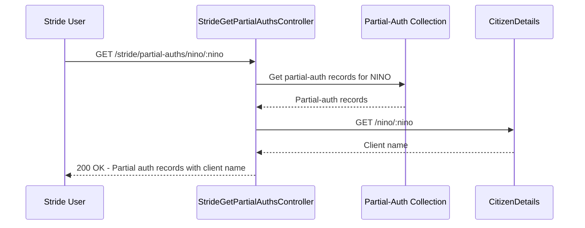

# ACR30: Stride Get Partial Authorizations

## Overview

Allows a Stride user to retrieve partial-authorization records for a client's NINO. Used by HMRC staff to view historical partial auth records.

## API Details

| Property | Value |
|----------|-------|
| **API ID** | ACR30 |
| **Method** | GET |
| **Path** | `/agent-client-relationships/stride/partial-auths/nino/{nino}` |
| **Controller** | StrideGetPartialAuthsController |

## Parameters

### Path Parameters

| Name | Type | Required | Description |
|------|------|----------|-------------|
| `nino` | string | Yes | Client National Insurance Number |

## Responses

- **200 OK**: Returns partial authorization records
- **404 Not Found**: No partial auth records found
- **401 Unauthorized**: Stride user not authenticated
- **403 Forbidden**: Insufficient Stride permissions

## Interaction Sequence

## Dependencies

### Internal

- **MongoDB Collections**:
  - `partial-auth`: Historical partial authorization records

### External

- **citizen-details**: Retrieve client name

## Notes

- Restricted to Stride-authenticated HMRC staff
- Shows historical partial auth relationships
- Used for customer support and audit purposes

---

## Document Metadata

**Last Updated:** 2025-11-20  
**Git Commit SHA:** `b2138b4e3958677748c1820c3d715d4fbb9d3b2c`  
**Analysis Version:** 1.0
