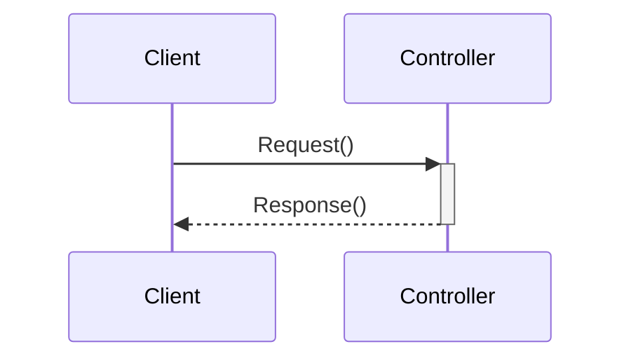
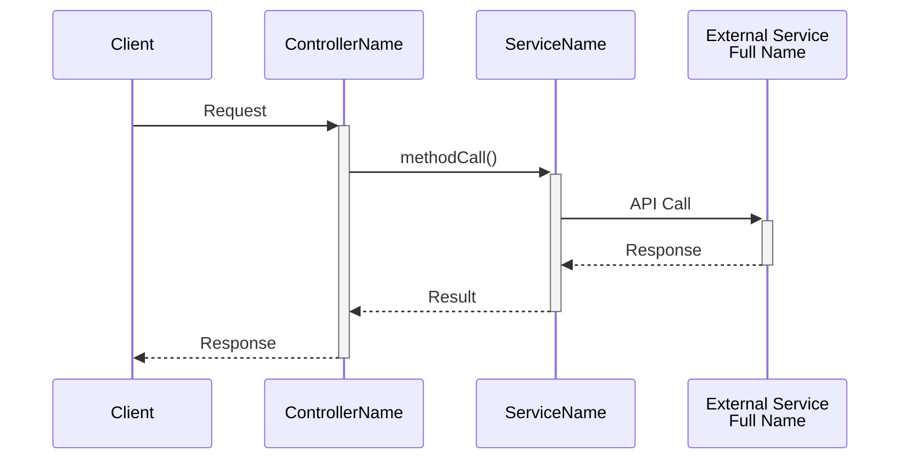

# API Analysis Documentation Guide

This guide explains the documentation structure and standards for API endpoint analysis in the agent-client-relationships service.

## Overview

Each API endpoint (ACR01-ACR34) is documented using three complementary files:
- **Mermaid Diagram (.mmd)**: Visual sequence diagram showing the interaction flow
- **Markdown Documentation (.md)**: Detailed human-readable documentation
- **JSON Metadata (.json)**: Structured machine-readable metadata

## File Structure

```
ACRxx/
├── ACRxx.mmd   # Mermaid sequence diagram
├── ACRxx.md    # Markdown documentation
└── ACRxx.json  # JSON metadata
```

## Git Commit SHA Tracking

**All analysis files must include the Git commit SHA** of the codebase they were analyzed against. This ensures traceability and helps identify when documentation may be outdated.

### How to Get Current Commit SHA

```bash
git rev-parse HEAD
```

### Where to Include the SHA

#### 1. Mermaid Diagram (.mmd)

Add metadata as comments at the top of the file:



#### 2. Markdown Documentation (.md)

Add a metadata section at the end of the document:

```markdown
---

## Document Metadata

**Last Updated:** YYYY-MM-DD  
**Git Commit SHA:** `[full 40-character SHA]`  
**Analysis Version:** 1.0
```

#### 3. JSON Metadata (.json)

Add a metadata object at the root level:

```json
{
    "apiId": "ACRxx",
    "apiTitle": "Short title",
    "metadata": {
        "lastUpdated": "YYYY-MM-DD",
        "gitCommitSha": "[full 40-character SHA]",
        "analysisVersion": "1.0"
    }
}
```

## JSON Structure

### Required Fields

```json
{
    "apiId": "ACRxx",
    "apiTitle": "Short title of the endpoint",
    "description": "Comprehensive description of what the endpoint does",
    "method": "GET",
    "path": "/api/path/with/:parameters",
    "pathParameters": {
        "param": "Description of parameter"
    }
}
```

### Service Dependencies

Document all services called by the endpoint:

```json
{
    "services": [
        {
            "name": "ServiceName",
            "fullName": "FullServiceClassName",
            "alias": "SS",
            "method": "methodName",
            "description": "What this service does"
        }
    ]
}
```

### External Dependencies

Document all external API calls:

```json
{
    "externalDependencies": [
        {
            "name": "External Service Name",
            "alias": "ESN",
            "endpoints": [
                {
                    "path": "/path/to/endpoint",
                    "method": "GET",
                    "description": "What this call does"
                }
            ]
        }
    ]
}
```

### Interaction Flow

Document the sequence of operations:

```json
{
    "interactionFlow": [
        {
            "step": 1,
            "actor": "Component Name (Alias)",
            "action": "calls service|calls external API|queries database|validates internally",
            "target": "Target Component",
            "method": "methodName or endpoint",
            "description": "What happens in this step",
            "conditional": "only if [condition]"
        }
    ]
}
```

### MongoDB Collections

Document database collections used:

```json
{
    "mongoCollectionsUsed": [
        {
            "collection": "collection-name",
            "operations": ["read", "write", "update", "delete"],
            "description": "How the collection is used"
        }
    ]
}
```

### Metadata

Always include metadata at the end:

```json
{
    "metadata": {
        "lastUpdated": "YYYY-MM-DD",
        "gitCommitSha": "full-40-character-sha",
        "analysisVersion": "1.0"
    }
}
```

## Mermaid Diagram Standards

### Participants

- Use clear, descriptive participant names
- Include aliases for brevity in the diagram
- Group related external services (e.g., "IF/HIP")
- Use line breaks (`<br/>`) for long participant names

### Terminology

- **EACD**: Enrolment Store Proxy (enrolment-store-proxy) - prefer "EACD" in documentation
- Always use full service names in participant declarations
- Use aliases consistently throughout the diagram

### Diagram Structure



### Best Practices

1. Use `activate`/`deactivate` for complex flows with multiple concurrent processes
2. Use `alt`/`else`/`opt` blocks for conditional logic
3. Add `Note` annotations for important clarifications
4. Use `-->>` for responses and `->>` for requests
5. Include `+`/`-` for activation/deactivation when helpful

### Mermaid validation (use mermaid-mcp)

Add guidance to validate Mermaid diagrams using the Mermaid Collaboration Platform (mcp). Use the following config snippet when calling the MCP validator or adding validation configuration in CI tools. This replaces older references to other validators.

JSON config example for tools that accept a validation config:

```json
{
  "mermaid-mcp": {
    "url": "https://mcp.mermaidchart.com/mcp",
    "type": "http"
  }
}
```

Notes:
- The MCP validates Mermaid syntax and returns detailed error locations; use it when mermaid CLI or other validators report ambiguous errors.
- If you receive a parser error that mentions reserved aliases (for example `par`), try renaming aliases to avoid reserved words and rerun validation.
- Keep participant aliases short and avoid common reserved words (e.g., `par`, `opt`, `alt`, `loop`).

## Markdown Documentation Standards

### Required Sections

1. **Overview**: High-level description of what the endpoint does
2. **API Details**: Method, path, auth, audience, controller
3. **Path Parameters**: Table of parameters with types and descriptions
4. **Query Parameters**: Table (if applicable)
5. **Request Body**: Schema and examples (if applicable)
6. **Response**: Success and error responses with examples
7. **Interaction Flow**: Step-by-step description of the sequence
8. **Service Details**: Description of each service/component involved
9. **External Dependencies**: Description of external APIs called
10. **MongoDB Collections**: Collections used and how
11. **Error Handling**: Common error scenarios
12. **Special Cases**: Any special logic or edge cases
13. **Performance Considerations**: Performance notes
14. **Notes**: Additional context
15. **Document Metadata**: Git SHA, date, version

### Response Examples

Always include sample JSON responses:

```markdown
### Success Response (200 OK)

**Response Body**:

\`\`\`json
{
  "field": "value"
}
\`\`\`
```

### Tables

Use tables for parameters:

```markdown
| Parameter | Type | Required | Description |
|-----------|------|----------|-------------|
| param1 | String | Yes | Description |
```

## Update Process

When updating documentation:

1. Get the current commit SHA: `git rev-parse HEAD`
2. Update all three files (.mmd, .md, .json)
3. Update the metadata sections with:
   - New lastUpdated date
   - Current Git commit SHA
   - Increment analysis version if significant changes

## Version History

- **1.0**: Initial standardization with Git commit SHA tracking (2025-11-20)

## References

- See `mongo.md` for MongoDB collection details
- See individual ACRxx folders for examples
- See `ACR01` for a complete reference implementation
