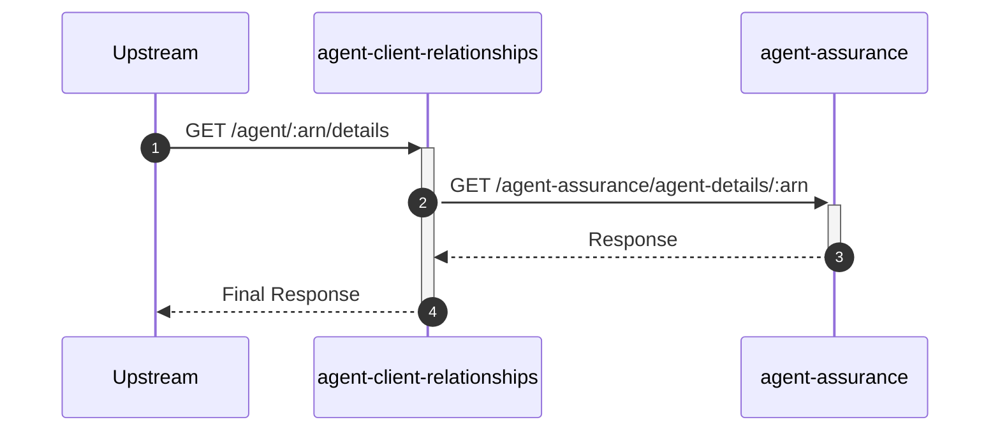

# agent-client-relationships

## AgentDetailsController

---

## GET /agent/:arn/details

**Description:** Retrieves public details about an agent, such as their name and address.

### Sequence of Interactions

1. **API Call:** `GET /agent-assurance/agent-details/:arn` to `agent-assurance`

### Sequence Diagram

