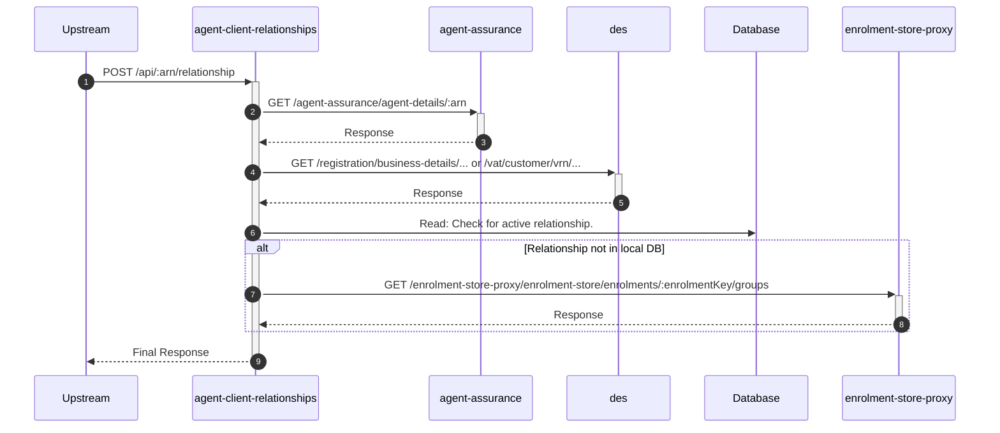

# agent-client-relationships

## ApiCheckRelationshipController

---

## POST /api/:arn/relationship

**Description:** Checks if a relationship exists between an agent and a client, performing validation checks.

### Sequence of Interactions

1. **API Call:** `GET /agent-assurance/agent-details/:arn` to `agent-assurance`
2. **API Call:** `GET /registration/business-details/... or /vat/customer/vrn/...` to `des`
3. **Database:** Read: Check for an existing active relationship in the relationships repository in `agent-client-relationships-db (relationships)`.
4. **API Call:** `GET /enrolment-store-proxy/enrolment-store/enrolments/:enrolmentKey/groups` to `enrolment-store-proxy` (If not in relationships repo)

### Sequence Diagram

