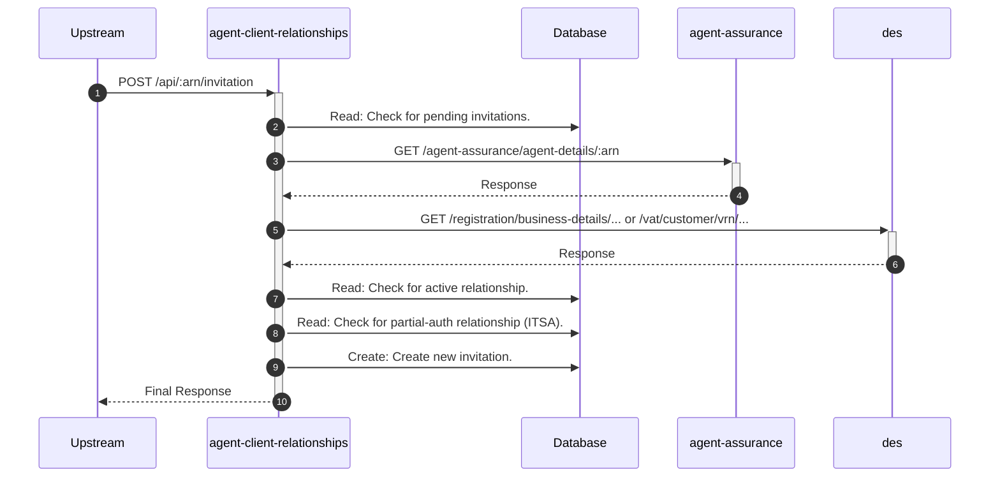

# agent-client-relationships

## ApiCreateInvitationController

---

## POST /api/:arn/invitation

**Description:** Creates an authorisation request (invitation) via the API, performing extensive validation.

### Sequence of Interactions

1. **Database:** Read: Check for existing pending invitations for the same agent, client, and service in `agent-client-relationships-db (invitations)`.
2. **API Call:** `GET /agent-assurance/agent-details/:arn` to `agent-assurance`
3. **API Call:** `GET /registration/business-details/... or /vat/customer/vrn/...` to `des`
4. **Database:** Read: Check for an existing active relationship in `agent-client-relationships-db (relationships)`.
5. **Database:** Read: For ITSA, check for an existing partial-auth relationship in `agent-client-relationships-db (partial-auth)`.
6. **Database:** Create: Create the new invitation record in `agent-client-relationships-db (invitations)`.

### Sequence Diagram

