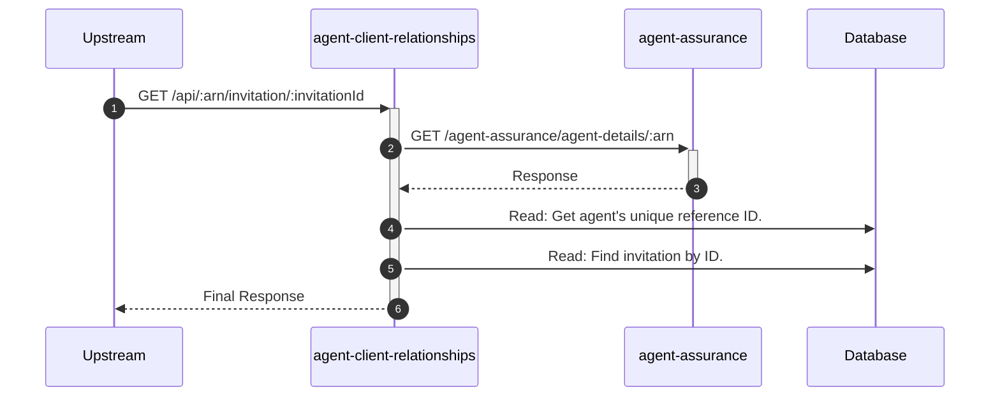

# agent-client-relationships

## ApiGetInvitationController

---

## GET /api/:arn/invitation/:invitationId

**Description:** Retrieves a specific authorisation request (invitation) by its ID for the authenticated agent.

### Sequence of Interactions

1. **API Call:** `GET /agent-assurance/agent-details/:arn` to `agent-assurance`
2. **Database:** Read: Get the agent's unique reference ID to construct the invitation link in `agent-client-relationships-db (agent-reference)`.
3. **Database:** Read: Find the invitation by its ID, ensuring it belongs to the requesting agent in `agent-client-relationships-db (invitations)`.

### Sequence Diagram

