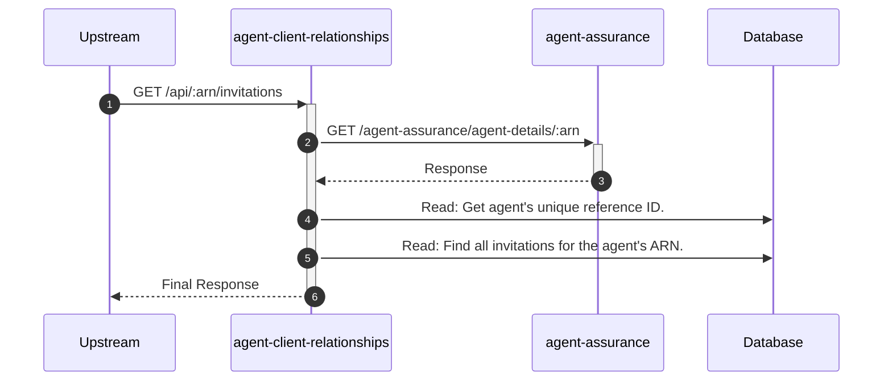

# agent-client-relationships

## ApiGetInvitationsController

---

## GET /api/:arn/invitations

**Description:** Retrieves all authorisation requests (invitations) for the authenticated agent.

### Sequence of Interactions

1. **API Call:** `GET /agent-assurance/agent-details/:arn` to `agent-assurance`
2. **Database:** Read: Get the agent's unique reference ID to construct invitation links in `agent-client-relationships-db (agent-reference)`.
3. **Database:** Read: Find all invitations for the agent's ARN in `agent-client-relationships-db (invitations)`.

### Sequence Diagram

