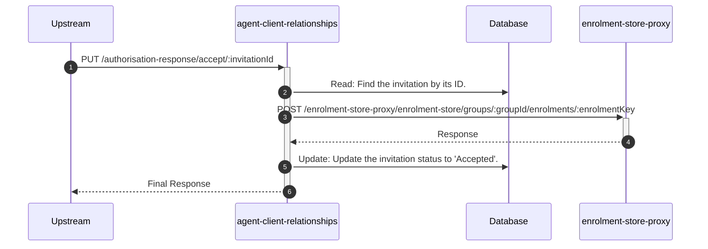

# agent-client-relationships

## AuthorisationAcceptController

---

## PUT /authorisation-response/accept/:invitationId

**Description:** Allows a client to accept a pending authorisation request (invitation), which creates an active relationship.

### Sequence of Interactions

1. **Database:** Read: Find the invitation by its ID in `agent-client-relationships-db (invitations)`.
2. **API Call:** `POST /enrolment-store-proxy/enrolment-store/groups/:groupId/enrolments/:enrolmentKey` to `enrolment-store-proxy`
3. **Database:** Update: Update the invitation status to 'Accepted' in `agent-client-relationships-db (invitations)`.

### Sequence Diagram

