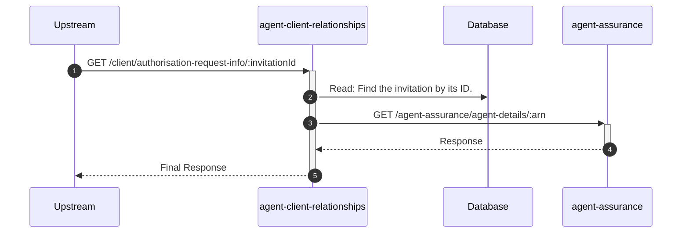
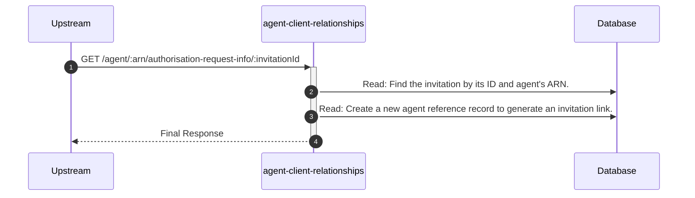
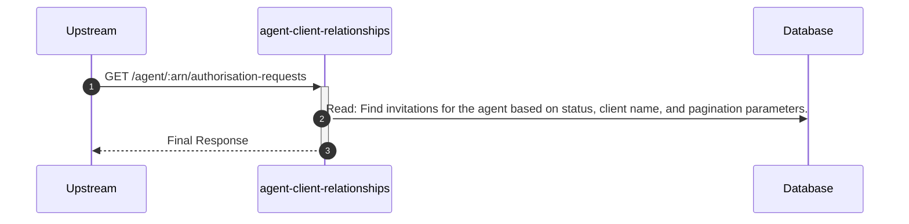

# agent-client-relationships

## AuthorisationRequestInfoController

---

## GET /client/authorisation-request-info/:invitationId

**Description:** Retrieves details about a specific authorisation request (invitation) for the client.

### Sequence of Interactions

1. **Database:** Read: Find the invitation by its ID in `agent-client-relationships-db (invitations)`.
2. **API Call:** `GET /agent-assurance/agent-details/:arn` to `agent-assurance`

### Sequence Diagram

---

## GET /agent/:arn/authorisation-request-info/:invitationId

**Description:** Retrieves details about a specific authorisation request (invitation) for the agent.

### Sequence of Interactions

1. **Database:** Read: Find the invitation by its ID and agent's ARN in `agent-client-relationships-db (invitations)`.
2. **Database:** Read: Create a new agent reference record to generate an invitation link in `agent-client-relationships-db (agent-reference)`.

### Sequence Diagram

---

## GET /agent/:arn/authorisation-requests

**Description:** Retrieves a paginated list of authorisation requests (invitations) for the agent, with optional filters.

### Sequence of Interactions

1. **Database:** Read: Find invitations for the agent based on status, client name, and pagination parameters in `agent-client-relationships-db (invitations)`.

### Sequence Diagram

