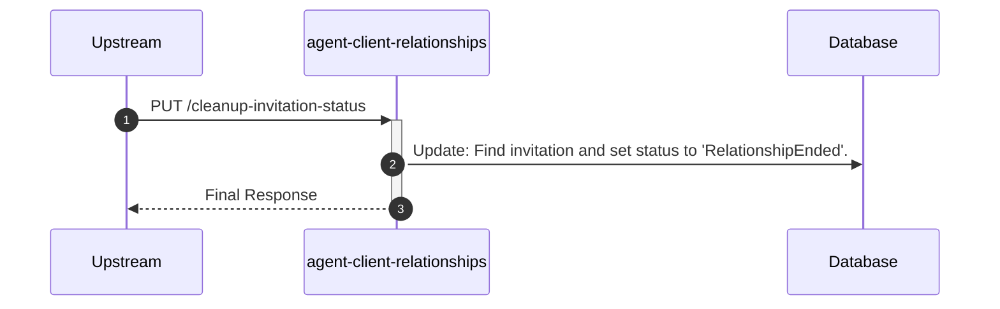

# agent-client-relationships

## CleanUpInvitationStatusController

---

## PUT /cleanup-invitation-status

**Description:** Allows a system process (e.g., Stride user) to mark an invitation as 'Relationship Ended' after a relationship has been terminated.

### Sequence of Interactions

1. **Database:** Update: Find the relevant invitation based on ARN, ClientID, and Service, and update its status to 'RelationshipEnded' in `agent-client-relationships-db (invitations)`.

### Sequence Diagram

