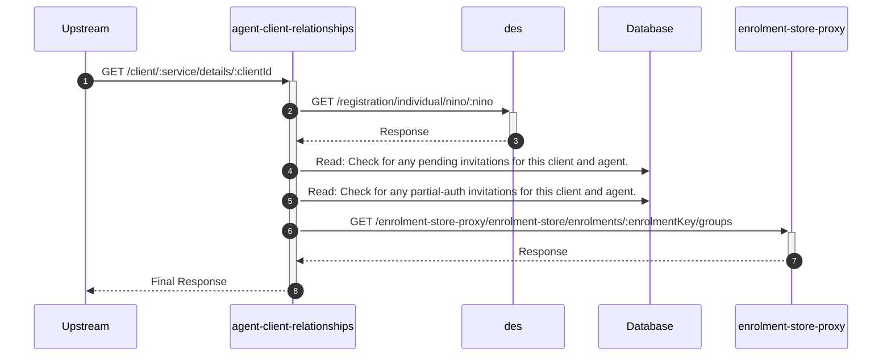

# agent-client-relationships

## ClientDetailsController

---

## GET /client/:service/details/:clientId

**Description:** Provides details about a client, including any pending invitations and existing relationships with the authenticated agent.

### Sequence of Interactions

1. **API Call:** `GET /registration/individual/nino/:nino` to `des`
2. **Database:** Read: Check for any pending invitations for this client and agent in `agent-client-relationships-db (invitations)`.
3. **Database:** Read: Check for any partial-auth invitations for this client and agent in `agent-client-relationships-db (partial-auth)`.
4. **API Call:** `GET /enrolment-store-proxy/enrolment-store/enrolments/:enrolmentKey/groups` to `enrolment-store-proxy`

### Sequence Diagram

