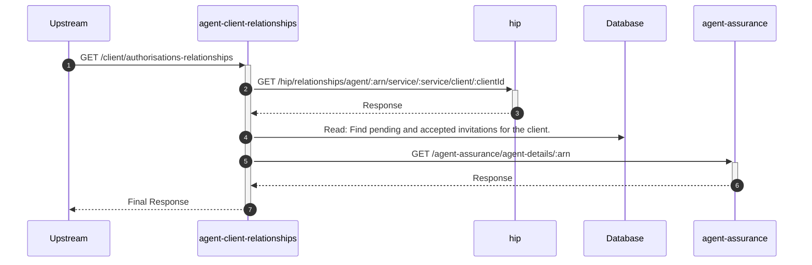

# agent-client-relationships

## ClientTaxAgentsDataController

---

## GET /client/authorisations-relationships

**Description:** Retrieves a consolidated view of an authenticated client's authorisations and relationships with agents.

### Sequence of Interactions

1. **API Call:** `GET /hip/relationships/agent/:arn/service/:service/client/:clientId` to `hip`
2. **Database:** Read: Find pending and accepted invitations for the client in `agent-client-relationships-db (invitations)`.
3. **API Call:** `GET /agent-assurance/agent-details/:arn` to `agent-assurance`

### Sequence Diagram

