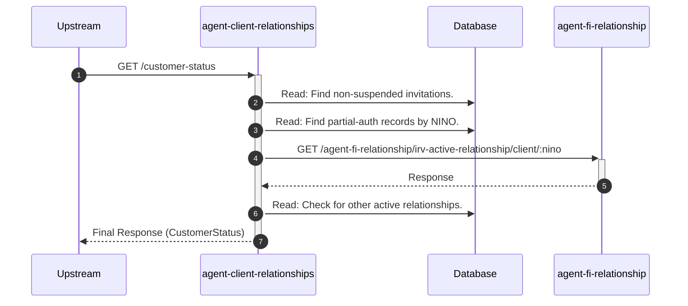

# agent-client-relationships

## CustomerStatusController

---

## GET /customer-status

**Description:** Provides a summary of the client's relationship status, including pending invitations, historical invitations, and active relationships.

### Sequence of Interactions

1. **Database:** Read: Find all non-suspended invitations for the client in `agent-client-relationships-db (invitations)`.
2. **Database:** Read: Find any partial-auth records for the client's NINO in `agent-client-relationships-db (partial-auth)`.
3. **API Call:** `GET /agent-fi-relationship/irv-active-relationship/client/:nino` to `agent-fi-relationship`
4. **Database:** Read: If no partial-auth or IRV relationship, check for any other active relationships in `agent-client-relationships-db (relationships)`.

### Sequence Diagram

