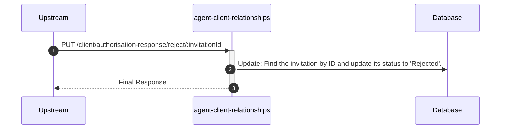
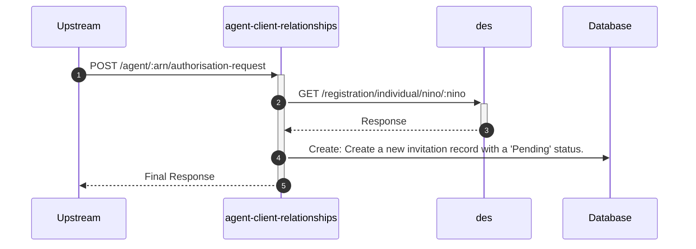
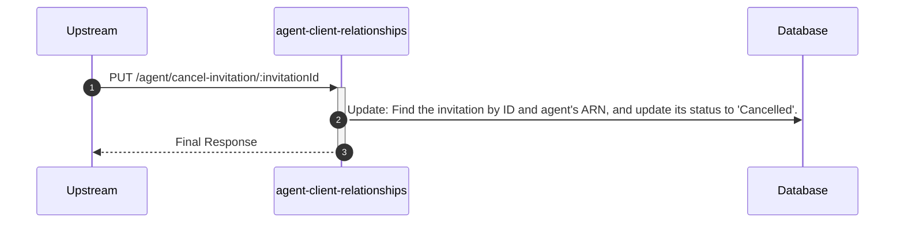
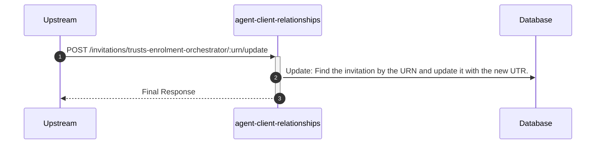

# agent-client-relationships

## InvitationController

---

## PUT /client/authorisation-response/reject/:invitationId

**Description:** Allows a client to reject a pending authorisation request (invitation).

### Sequence of Interactions

1. **Database:** Update: Find the invitation by ID and update its status to 'Rejected' in `agent-client-relationships-db (invitations)`.

### Sequence Diagram

---

## POST /agent/:arn/authorisation-request

**Description:** Allows an agent to create a new authorisation request (invitation) for a client.

### Sequence of Interactions

1. **API Call:** `GET /registration/individual/nino/:nino` to `des`
2. **Database:** Create: Create a new invitation record with a 'Pending' status in `agent-client-relationships-db (invitations)`.

### Sequence Diagram

---

## PUT /agent/cancel-invitation/:invitationId

**Description:** Allows an agent to cancel a pending authorisation request (invitation) they have previously sent.

### Sequence of Interactions

1. **Database:** Update: Find the invitation by ID and agent's ARN, and update its status to 'Cancelled' in `agent-client-relationships-db (invitations)`.

### Sequence Diagram

---

## POST /invitations/trusts-enrolment-orchestrator/:urn/update

**Description:** Updates a trust-related invitation by replacing the temporary URN with the permanent UTR after registration.

### Sequence of Interactions

1. **Database:** Update: Find the invitation by the URN and update it with the new UTR in `agent-client-relationships-db (invitations)`.

### Sequence Diagram

