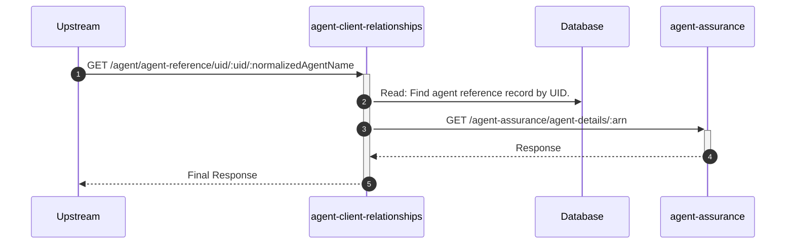
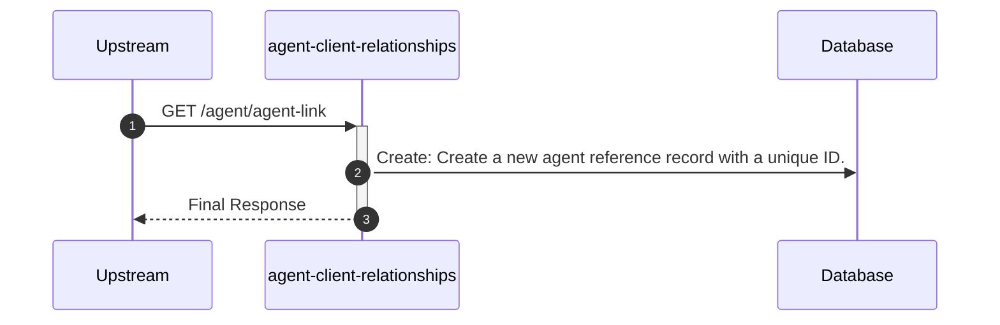
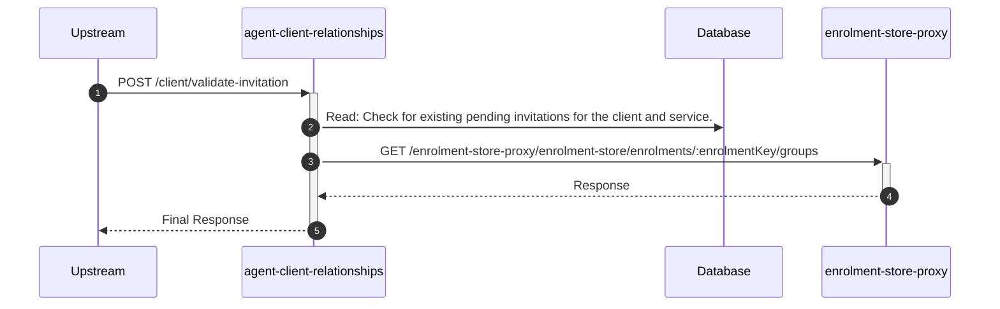

# agent-client-relationships

## InvitationLinkController

---

## GET /agent/agent-reference/uid/:uid/:normalizedAgentName

**Description:** Validates an agent's invitation link using a unique ID and a normalized version of the agent's name.

### Sequence of Interactions

1. **Database:** Read: Find agent reference record by UID in `agent-client-relationships-db (agent-reference)`.
2. **API Call:** `GET /agent-assurance/agent-details/:arn` to `agent-assurance`

### Sequence Diagram

---

## GET /agent/agent-link

**Description:** Creates a unique, shareable invitation link for the authenticated agent.

### Sequence of Interactions

1. **Database:** Create: Create a new agent reference record with a unique ID in `agent-client-relationships-db (agent-reference)`.

### Sequence Diagram

---

## POST /client/validate-invitation

**Description:** Allows a client to validate an invitation they have received, checking for existing relationships or other pending invitations.

### Sequence of Interactions

1. **Database:** Read: Check for existing pending invitations for the client and service in `agent-client-relationships-db (invitations)`.
2. **API Call:** `GET /enrolment-store-proxy/enrolment-store/enrolments/:enrolmentKey/groups` to `enrolment-store-proxy`

### Sequence Diagram

