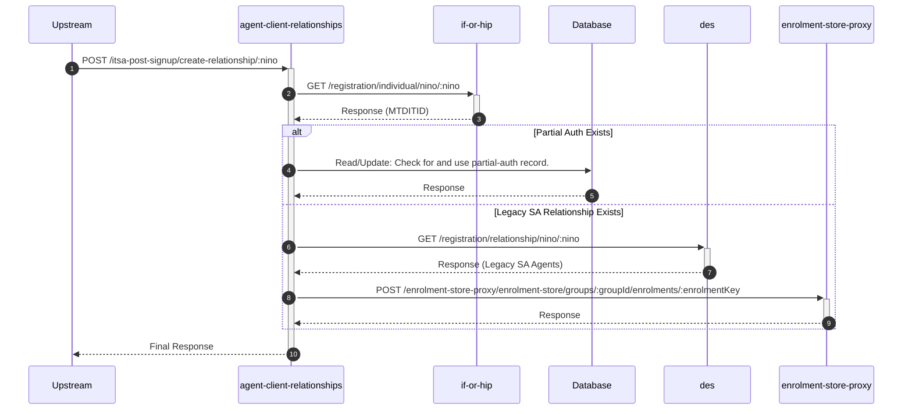

# agent-client-relationships

## ItsaPostSignupController

---

## POST /itsa-post-signup/create-relationship/:nino

**Description:** Creates an ITSA relationship for a client after they have signed up, by either converting a partial-auth relationship or copying a legacy SA relationship.

### Sequence of Interactions

1. **API Call:** `GET /registration/individual/nino/:nino` to `if-or-hip`
2. **Database:** Read/Update: Check for a partial-auth record and attempt to create a full relationship from it in `agent-client-relationships-db (partial-auth)`.
3. **API Call:** `GET /registration/relationship/nino/:nino` to `des` (If no partial-auth)
4. **API Call:** `POST /enrolment-store-proxy/enrolment-store/groups/:groupId/enrolments/:enrolmentKey` to `enrolment-store-proxy` (If legacy relationship found)

### Sequence Diagram

