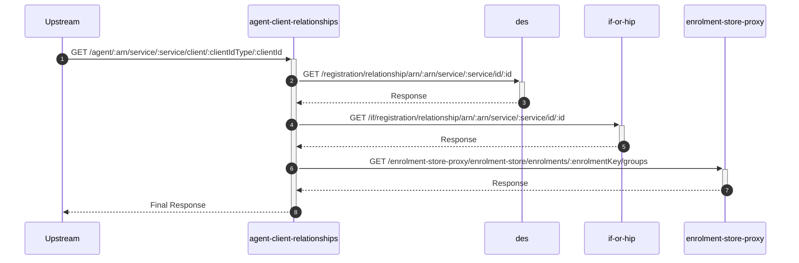
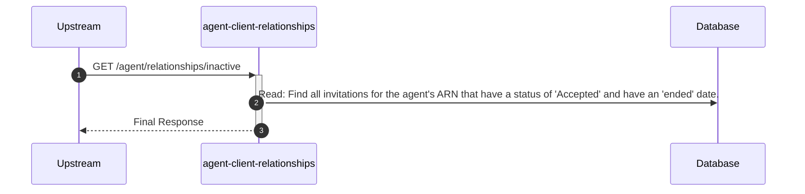
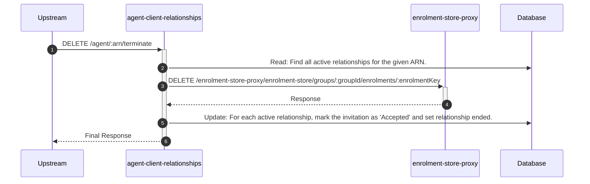
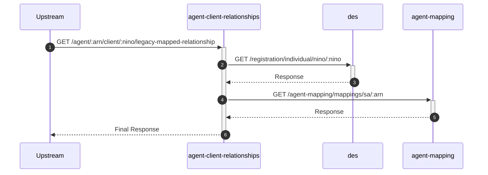
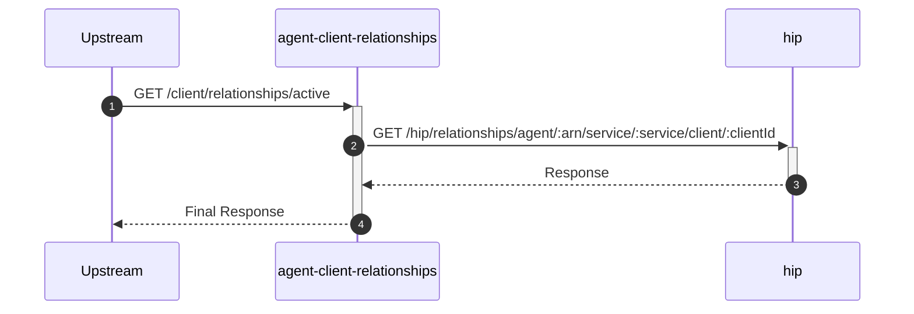
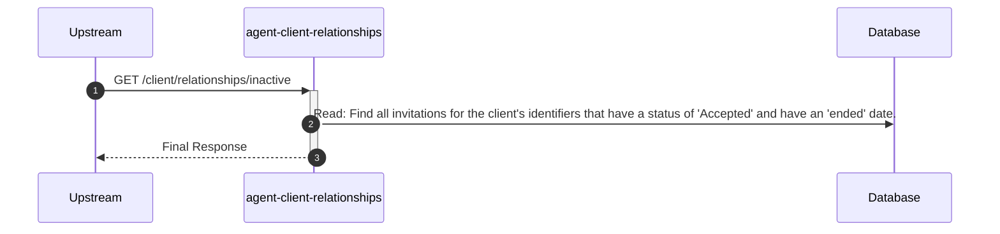
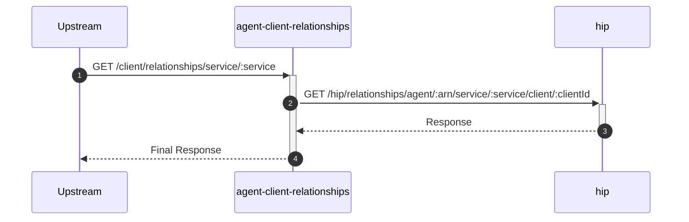
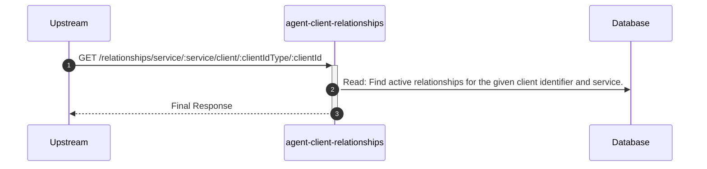

# agent-client-relationships

## RelationshipsController

---

## GET /agent/:arn/service/:service/client/:clientIdType/:clientId

**Description:** Checks if a relationship exists between an agent and a client for a specific service.

### Sequence of Interactions

1. **API Call:** `GET /registration/relationship/arn/:arn/service/:service/id/:id` to `des`
2. **API Call:** `GET /if/registration/relationship/arn/:arn/service/:service/id/:id` to `if-or-hip`
3. **API Call:** `GET /enrolment-store-proxy/enrolment-store/enrolments/:enrolmentKey/groups` to `enrolment-store-proxy`

### Sequence Diagram

---

## GET /agent/relationships/inactive

**Description:** Retrieves a list of all inactive (terminated) relationships for the authenticated agent.

### Sequence of Interactions

1. **Database:** Read: Find all invitations for the agent's ARN that have a status of 'Accepted' and have an 'ended' date in `agent-client-relationships-db (invitations)`.

### Sequence Diagram

---

## DELETE /agent/:arn/terminate

**Description:** Terminates all of an agent's client relationships. This is a destructive, agent-initiated action.

### Sequence of Interactions

1. **Database:** Read: Find all active relationships for the given ARN in `agent-client-relationships-db (invitations)`.
2. **API Call:** `DELETE /enrolment-store-proxy/enrolment-store/groups/:groupId/enrolments/:enrolmentKey` to `enrolment-store-proxy`
3. **Database:** Update: For each active relationship, mark the invitation as 'Accepted' and set relationship ended in `agent-client-relationships-db (invitations)`.

### Sequence Diagram

---

## GET /agent/:arn/client/:nino/legacy-mapped-relationship

**Description:** Checks if a client has a legacy SA relationship in CESA and if that relationship has been mapped to the agent's ARN.

### Sequence of Interactions

1. **API Call:** `GET /registration/individual/nino/:nino` to `des`
2. **API Call:** `GET /agent-mapping/mappings/sa/:arn` to `agent-mapping`

### Sequence Diagram

---

## GET /client/relationships/active

**Description:** Retrieves all active relationships for the authenticated client across all their enrolled services.

### Sequence of Interactions

1. **API Call:** `GET /hip/relationships/agent/:arn/service/:service/client/:clientId` to `hip`

### Sequence Diagram

---

## GET /client/relationships/inactive

**Description:** Retrieves all inactive (terminated) relationships for the authenticated client.

### Sequence of Interactions

1. **Database:** Read: Find all invitations for the client's identifiers that have a status of 'Accepted' and have an 'ended' date in `agent-client-relationships-db (invitations)`.

### Sequence Diagram

---

## GET /client/relationships/service/:service

**Description:** Retrieves the active agent relationship for a specific service for the authenticated client.

### Sequence of Interactions

1. **API Call:** `GET /hip/relationships/agent/:arn/service/:service/client/:clientId` to `hip`

### Sequence Diagram

---

## GET /relationships/service/:service/client/:clientIdType/:clientId

**Description:** Allows a Stride user to retrieve active relationships for a specific client.

### Sequence of Interactions

1. **Database:** Read: Find active relationships for the given client identifier and service in `agent-client-relationships-db (relationships)`.

### Sequence Diagram

