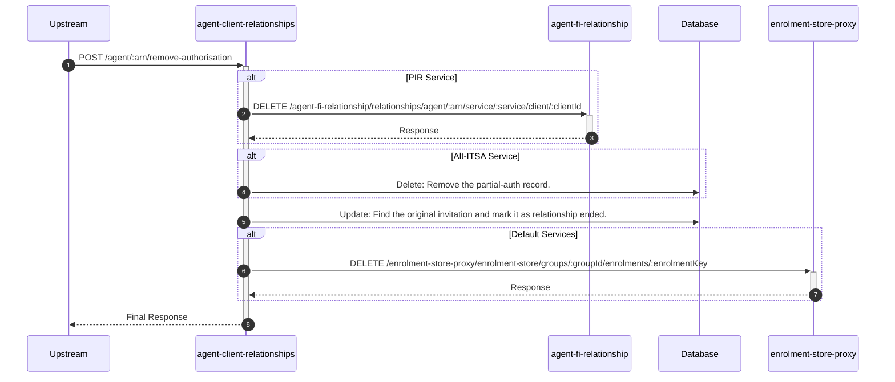

# agent-client-relationships

## RemoveAuthorisationController

---

## POST /agent/:arn/remove-authorisation

**Description:** Allows an agent or a Stride user to remove an existing authorisation (relationship).

### Sequence of Interactions

1. **API Call:** `DELETE /agent-fi-relationship/relationships/agent/:arn/service/:service/client/:clientId` to `agent-fi-relationship` (For PIR service)
2. **Database:** Delete: Remove the partial-auth record in `agent-client-relationships-db (partial-auth)` (For Alt-ITSA)
3. **Database:** Update: Find the original invitation and mark it as relationship ended in `agent-client-relationships-db (invitations)` (For all services)
4. **API Call:** `DELETE /enrolment-store-proxy/enrolment-store/groups/:groupId/enrolments/:enrolmentKey` to `enrolment-store-proxy` (For default services)

### Sequence Diagram

