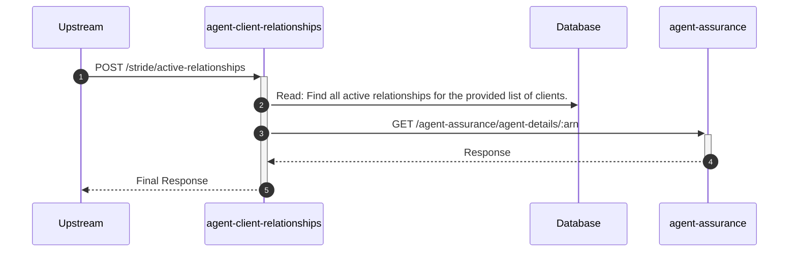
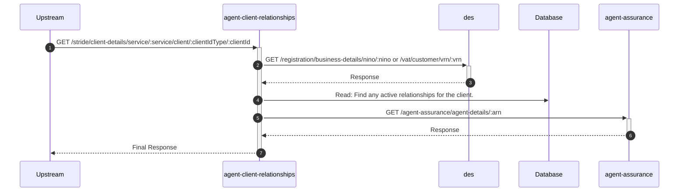
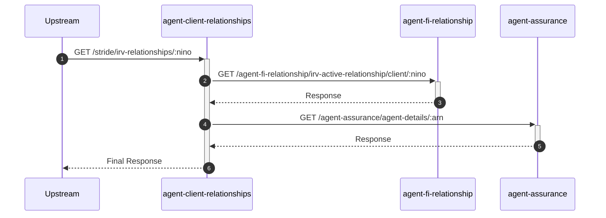

# agent-client-relationships

## StrideClientDetailsController

---

## POST /stride/active-relationships

**Description:** Allows a Stride user to retrieve a list of active client relationships for a given set of client identifiers.

### Sequence of Interactions

1. **Database:** Read: Find all active relationships for the provided list of clients in `agent-client-relationships-db (relationships)`.
2. **API Call:** `GET /agent-assurance/agent-details/:arn` to `agent-assurance`

### Sequence Diagram

---

## GET /stride/client-details/service/:service/client/:clientIdType/:clientId

**Description:** Allows a Stride user to retrieve comprehensive details for a client, including any active relationships.

### Sequence of Interactions

1. **API Call:** `GET /registration/business-details/nino/:nino or /vat/customer/vrn/:vrn` to `des`
2. **Database:** Read: Find any active relationships for the client in `agent-client-relationships-db (relationships)`.
3. **API Call:** `GET /agent-assurance/agent-details/:arn` to `agent-assurance` (If relationship exists)

### Sequence Diagram

---

## GET /stride/irv-relationships/:nino

**Description:** Allows a Stride user to retrieve active IRV (Income Record Viewer) relationships for a client's NINO.

### Sequence of Interactions

1. **API Call:** `GET /agent-fi-relationship/irv-active-relationship/client/:nino` to `agent-fi-relationship`
2. **API Call:** `GET /agent-assurance/agent-details/:arn` to `agent-assurance`

### Sequence Diagram

