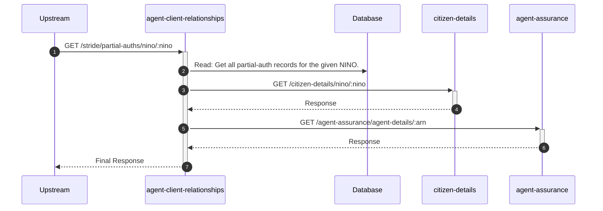

# agent-client-relationships

## StrideGetPartialAuthsController

---

## GET /stride/partial-auths/nino/:nino

**Description:** Allows a Stride user to retrieve partial-authorisation records for a client's NINO.

### Sequence of Interactions

1. **Database:** Read: Get all partial-auth records for the given NINO in `agent-client-relationships-db (partial-auth)`.
2. **API Call:** `GET /citizen-details/nino/:nino` to `citizen-details`
3. **API Call:** `GET /agent-assurance/agent-details/:arn` to `agent-assurance`

### Sequence Diagram

